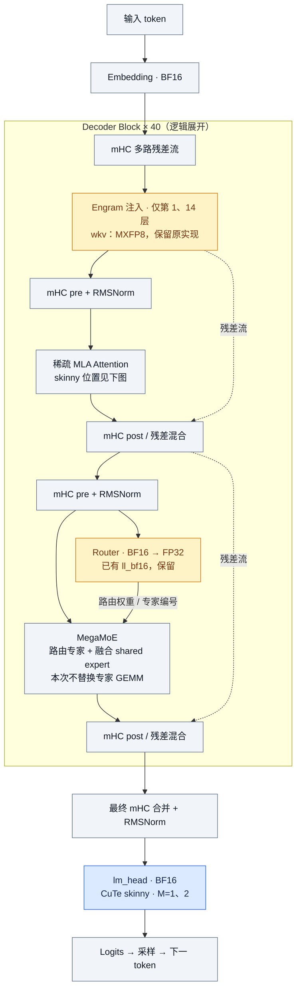
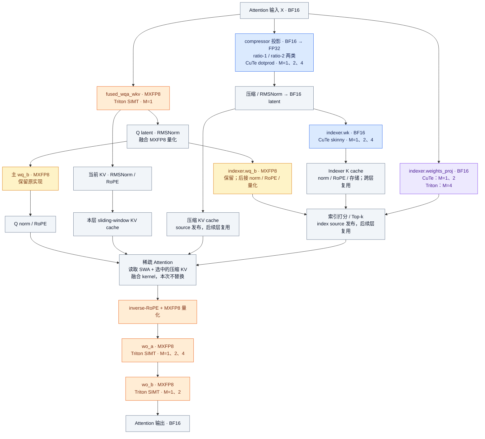

# DSV4.1 Flash：MXFP8 与 skinny GEMM 位置

范围：node30 实测的 40 层文本 backbone，TP8，M≤4 实验分发表。没有启用 DSpark/MTP；图不展开视觉编码器。M 是传给本卡 GEMM 的行数；1、2、4 是离散档，不包含 3。

## 为什么使用 MXFP8

基线服务已经使用 deepseek_v4_fp8 量化加载路径，主投影实际后端是 FlashInferCutedslMxfp8LinearKernel 与 DeepGemmMxfp8BmmLinearKernel。MXFP8 是当前主投影的数据表示，skinny 本身并不要求这种格式。BF16、FP16、FP8 都可以编写小 M 的专用 GEMM。

MXFP8 为每 32 个连续 FP8 元素配一个 E8M0 scale（2 的幂）。不计 padding，32 个 BF16 数需要 64 字节，而 MXFP8 需要 32+1=33 字节；小块缩放改善不同局部数值范围的表示。Blackwell 支持相应的原生块缩放矩阵运算。参考 [NVIDIA MXFP8 文档](https://docs.nvidia.com/deeplearning/transformer-engine/features/low_precision_training/mxfp8/mxfp8.html)。

当前 skinny 的目标是保持原来的数值路径：使用原 MXFP8 权重、scale，并保留输入激活的 FP8 舍入。它不要求 kernel 必须使用 Tensor Core：当前获胜的 MXFP8 路径读取 FP8 与 scale 后用 SIMT 累加。把权重展开成 BF16 可以作为另一种实验，但会增加这些权重的常驻体积和读取流量；若同时跳过原有激活量化，还会改变所比较的数值计算。这里没有把 BF16 展开方案称为数学上不允许。

MXFP8 主投影、BF16 辅助投影、专家低精度路径和 FP8 KV cache 是不同部位的精度选择；--kv-cache-dtype fp8 不负责把线性层变成 MXFP8。

## 整体模型

蓝色：已选择 CuTe；橙色：已选择 Triton；紫色：按 M 混合；黄色：保留原实现。灰色模块未在本次普通 GEMM skinny 实验中替换。颜色表达实验接入状态，不表示整个模型所有算子只使用一种精度。

mHC 按逻辑 pre/post 展开；实际代码有跨相邻子层的延迟混合与融合。Engram 层编号从 0 开始。图省略 TP/SP collectives、部分缓存更新细节；实际 TP8 执行含 all-gather/reduce-scatter 等通信。

## 稀疏注意力展开

图表示具有 compressor/indexer 的 source 层的主要数据依赖。只有 KV source 2/8/14/20 创建 compressor；只有 index source 2/8/14/20/24/28/32/36 创建 indexer；indexer.wk 仅在 KV source 上创建。消费者复用对应 source 的 cache/Top-k，不重复执行图中的所有辅助投影。前两层仅使用 SWA。

三个从 X 出发的输入投影可并行调度；图表示依赖关系，不表示所有节点串行，也不能把单 kernel 节省直接相加成端到端收益。短上下文等运行条件还可能跳过索引打分。

## Skinny 的具体方法

| 实现 | 对应位置 | 方法 |
| --- | --- | --- |
| Triton MXFP8 SIMT | fused_wqa_wkv、wo_a、wo_b | 沿 N 分配少量输出，线程沿 K 计算点积并归约；读取 FP8 与 E8M0 scale，FP32 累加后输出 BF16。原始 BF16 输入路径保留分块 FP8 量化；wo_a 接收配套 inverse-RoPE 生成的已量化输入。 |
| CuTe BF16 skinny | lm_head、indexer.wk、weights_proj 的 M1/2 | 复用 vLLM 现有 kernel：向量化载入、寄存器内乘加、小 M 展开、warp/block 归约。 |
| CuTe ll_bf16 dotprod | ratio-1/2 compressor 的投影 | 同类小 M 点积组织，保持 FP32 输出，供后续门控/压缩使用。 |
| Triton BF16 SIMT | weights_proj 的 M4 | 小输出宽度下按 N/K 划分点积与归约，输出 BF16。 |

main/indexer wq_b 已共享 Q norm 后的量化输入；没有额外重复量化可直接删掉。当前候选未胜出，图中保留现有实现。Engram wkv 也没有选中候选；router 已使用 ll_bf16。mHC、稀疏注意力和专家内部仍有矩阵计算，只是不在本次独立 Linear 替换范围。

## 可核对的代码与产物

- [基线服务日志](bench-a/server.log)：量化配置与实际 MXFP8 后端。
- [实际模型库存](inventory-rank0.json)：每层投影类型、形状、精度。
- [最终 M≤4 分发表](bench-lowm/selected.json)。
- [模型 block 与 mHC](../../../../vllm/models/deepseek_v4_1/nvidia/model.py#L163)。
- [Attention 主流程、source 拓扑与 Indexer](../../../../vllm/models/deepseek_v4_1/attention.py#L210)。
- [Compressor](../../../../vllm/models/deepseek_v4_1/compressor.py#L171)。
- [Triton 实现](kernels.py)、[候选后端调用](screen.py)、[模型接入](dispatch.py)。
- [完整 GEMM 分发表](gemm-dispatch-tables.md)、[性能与数值验证](RESULTS.md)。
