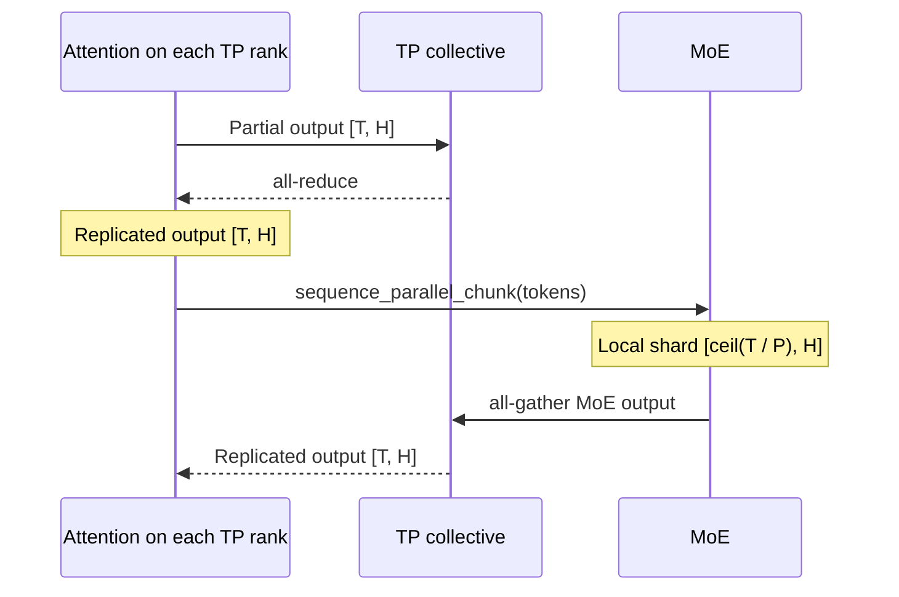
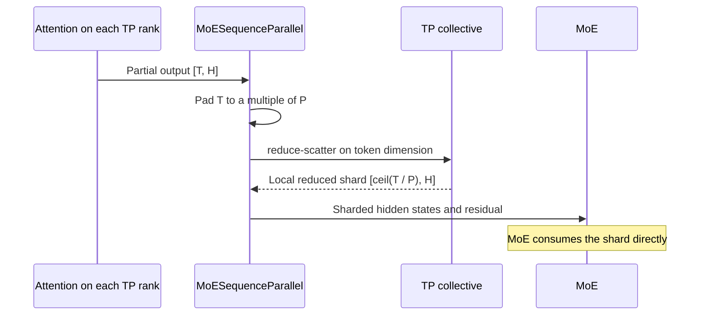
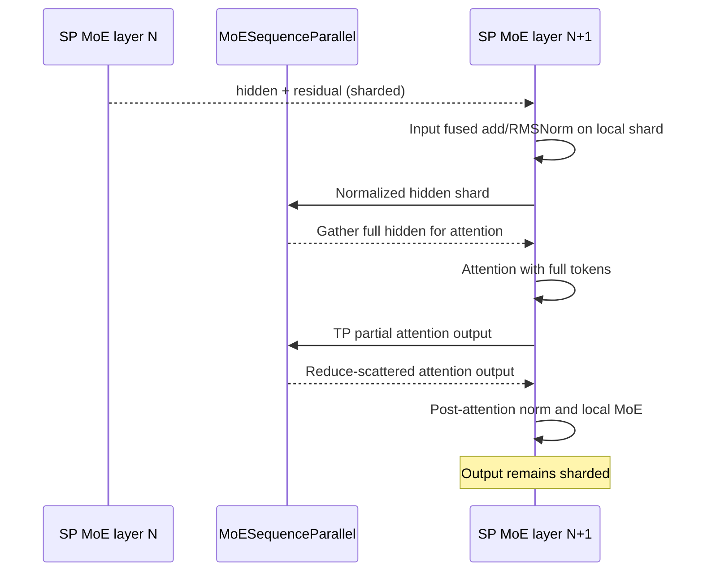
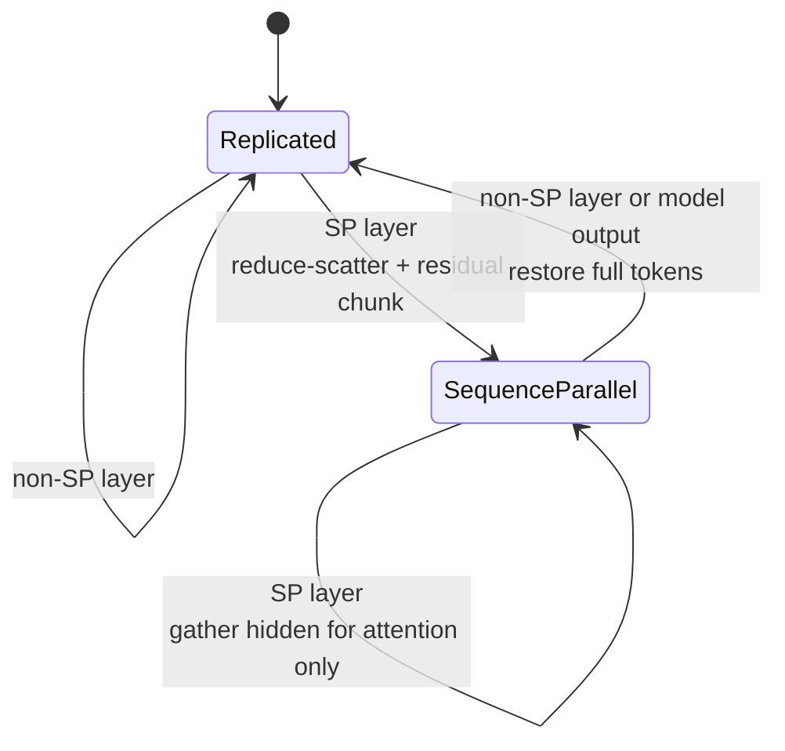
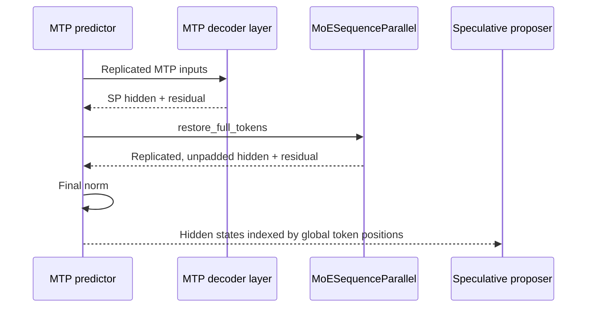

# RFC: A Reusable MoE Sequence-Parallel Integration API

## Status

- **Status:** Draft
- **Audience:** vLLM model and distributed-runtime maintainers
- **Scope:** Tensor-parallel attention followed by expert-parallel MoE
- **Initial users:** DeepSeek, Qwen3-Next, and Qwen3.5-MoE

## Summary

Several MoE models in vLLM use the same communication optimization at the
attention-to-MoE boundary:

1. Keep the tensor-parallel partial result of the attention output projection.
2. Reduce-scatter that result along the token dimension.
3. Run MoE directly on the local token shard.
4. Keep the token-sharded layout across consecutive compatible MoE layers.
5. Restore the full token layout only when a consumer requires it.

Today, each model implements the layout transitions, padding, residual
handling, and output restoration itself. DeepSeek and Qwen already contain
substantially duplicated implementations. This makes a performance feature
look like model-specific control flow and makes correctness bugs likely at
model exits such as final normalization, auxiliary hidden-state capture, and
multi-token prediction (MTP).

This RFC proposes a small, reusable `MoESequenceParallel` adapter. It owns the
mechanics of token-layout conversion while models retain control over their
architecture-specific computation order. Models explicitly track whether the
current hidden states are replicated or sequence-parallel; tensor shape is
never used to infer layout.

The intended result is that a new model can adopt the optimization by:

- identifying its MoE layers;
- disabling the attention output all-reduce for those layers;
- calling one adapter method before attention and one before MoE;
- tracking one layout boolean in the model loop; and
- restoring full tokens at externally visible outputs.

## Motivation

### The unoptimized communication path

A tensor-parallel row-parallel attention output projection normally performs
an all-reduce. Every TP rank consequently receives the same complete attention
output. A sequence-parallel MoE implementation then immediately partitions
that complete tensor along the token dimension.



For `T` tokens and TP size `P`, the boundary performs:

```text
TP partial output
    -> all-reduce
    -> replicated tokens
    -> local token chunk
    -> MoE
    -> all-gather
    -> replicated tokens
```

The all-reduce followed immediately by token partitioning communicates and
materializes data that MoE does not need locally.

### The optimized communication path

The optimized path configures the attention output projection with
`reduce_results=False`. Its TP partial output is then reduce-scattered along
the token dimension. Reduction and token partitioning happen in one
collective.



The boundary becomes:

```text
TP partial output
    -> token-dimension reduce-scatter
    -> MoE
```

For consecutive compatible MoE layers, the MoE output remains sharded. The
next layer gathers only the normalized hidden states needed by attention; its
residual stream remains sharded.



### Why a shared abstraction is needed

The optimized path has several non-obvious correctness requirements:

- The token dimension must be padded before reduce-scatter when `T % P != 0`.
- Padding must be removed when the full layout is restored.
- The residual must be partitioned exactly once when entering the sharded
  layout.
- A consecutive SP layer must gather the normalized attention input, but it
  should not gather the residual stream.
- A non-SP layer must receive the complete hidden and residual tensors.
- Final normalization, logits-facing outputs, auxiliary hidden states, and MTP
  outputs must receive the layout they expect.
- Layout cannot be inferred from tensor shape.

The last point is especially important. For `T = 1` and `P = 4`, the input is
padded to four rows and each rank receives one row after reduce-scatter. Both a
replicated tensor and a sequence-parallel shard therefore have shape `[1, H]`,
although ranks 1 through 3 contain padding. A check such as

```python
hidden_states.shape[0] != full_num_tokens
```

cannot distinguish the two layouts.

These rules describe a distributed tensor layout, not a property of Qwen or
DeepSeek. They should have one implementation and one documented contract.

## Goals

1. Make MoE sequence parallelism straightforward to adopt in another model.
2. Centralize padding, reduce-scatter, all-gather, and residual partitioning.
3. Replace shape-based layout inference with explicit state.
4. Keep model-specific layer ordering visible in each model implementation.
5. Give final norm, auxiliary outputs, and MTP a uniform restoration API.
6. Preserve compatibility with `torch.compile` and CUDA Graphs.
7. Make incorrect layout transitions fail early in debug and test builds.

## Non-goals

- Defining a common decoder-layer base class for every model architecture.
- Hiding attention, normalization, layer-scale, or residual ordering.
- Changing fused MoE dispatch or all-to-all implementations.
- Enabling sequence-parallel tensors across pipeline-parallel stage boundaries.
- Making every possible tensor layout dynamically selectable at runtime.
- Replacing existing tensor-parallel collective primitives.

## Terminology and invariants

This RFC uses two logical token layouts.

| Layout | Per-rank shape | Meaning |
| --- | --- | --- |
| Replicated | `[T, H]` | Every TP rank owns all real tokens. Values may still be TP partial before a required reduction. |
| Sequence-parallel | `[ceil(T / P), H]` | Each TP rank owns one contiguous chunk of the sequence padded to a multiple of `P`. |

The runtime representation of the layout is an explicit boolean:

```python
is_sequence_parallel: bool
```

The boolean is authoritative. Shapes may be asserted against it, but shapes
must not be used to derive it.

The following invariants apply:

1. `full_num_tokens` always means the number of real, unpadded tokens.
2. A sequence-parallel tensor has
   `ceil(full_num_tokens / tp_world_size)` rows on every TP rank.
3. Padding rows are an implementation detail and never escape a restoration
   boundary.
4. `hidden_states` and `residual` have the same token layout whenever both are
   passed to a fused add/RMSNorm operation.
5. An SP-enabled decoder layer returns sequence-parallel hidden and residual
   tensors.
6. A non-SP decoder layer returns replicated hidden and residual tensors.
7. Public model outputs are replicated unless their API explicitly documents
   another layout.

## Proposed API

### Location

Add a model-independent helper module:

```text
vllm/model_executor/layers/moe_sequence_parallel.py
```

The helper belongs under `layers`, rather than `models`, because its behavior
is independent of model architecture and is shared by attention-to-MoE layer
boundaries.

### Adapter

The proposed public surface separates layer-local transitions from model-output
materialization:

```python
class MoESequenceParallel:
    """Token-layout transitions for sequence-parallel MoE layers.

    `enabled` is static for a decoder layer. It may depend on model
    architecture and parallel configuration, but it must not change between
    forwards.
    """

    def __init__(
        self,
        *,
        enabled: bool,
    ) -> None:
        self.enabled = enabled

    @property
    def reduce_attention_results(self) -> bool:
        """Whether the attention output projection performs its all-reduce."""
        return not self.enabled

    def gather_for_attention(
        self,
        hidden_states: torch.Tensor,
        *,
        full_num_tokens: int,
        input_is_sequence_parallel: bool,
    ) -> torch.Tensor:
        """Materialize the full normalized attention input when required."""

    def reduce_scatter_for_moe(
        self,
        hidden_states: torch.Tensor,
        residual: torch.Tensor,
        *,
        input_is_sequence_parallel: bool,
    ) -> tuple[torch.Tensor, torch.Tensor]:
        """Convert the attention result and residual to the local token shard."""


def restore_full_tokens(
    hidden_states: torch.Tensor,
    residual: torch.Tensor | None,
    *,
    full_num_tokens: int,
    hidden_size: int,
    input_is_sequence_parallel: bool,
) -> tuple[torch.Tensor, torch.Tensor | None]:
    """Restore sharded states at a full-token materialization boundary."""
```

The adapter is deliberately not an `nn.Module`. It has no parameters or
buffers, and its `enabled` flag is configuration-static. Implementations
should use ordinary functions and existing vLLM custom collective operators so
that Dynamo specializes on the static path.

### `reduce_attention_results`

Models currently need to know whether the row-parallel output projection must
perform an all-reduce. Exposing the inverse through the adapter keeps the
configuration in one place:

```python
self.self_attn = ModelAttention(
    ...,
    reduce_results=self.moe_sp.reduce_attention_results,
)
```

When the adapter is disabled, the existing attention behavior is unchanged.

### `gather_for_attention`

Attention requires a complete token sequence, while the input from the
previous SP MoE layer may be sharded. Input add/RMSNorm can run on the shard,
so only the normalized hidden states are gathered:

```python
def gather_for_attention(
    self,
    hidden_states: torch.Tensor,
    *,
    full_num_tokens: int,
    input_is_sequence_parallel: bool,
) -> torch.Tensor:
    if not input_is_sequence_parallel:
        return hidden_states

    hidden_states = tensor_model_parallel_all_gather(hidden_states, dim=0)
    return hidden_states[:full_num_tokens]
```

This method does not gather `residual`. Keeping the residual sharded avoids an
unnecessary communication and allows the layer to remain in SP layout after
MoE.

### `reduce_scatter_for_moe`

An enabled layer converts the TP partial attention result into a reduced local
token shard. If the residual entered in replicated layout, it is partitioned
at the same transition:

```python
def reduce_scatter_for_moe(
    self,
    hidden_states: torch.Tensor,
    residual: torch.Tensor,
    *,
    input_is_sequence_parallel: bool,
) -> tuple[torch.Tensor, torch.Tensor]:
    if not self.enabled:
        return hidden_states, residual

    tp_size = get_tensor_model_parallel_world_size()
    pad = (-hidden_states.shape[0]) % tp_size
    hidden_states = torch.nn.functional.pad(
        hidden_states,
        (0, 0, 0, pad),
    )
    hidden_states = tensor_model_parallel_reduce_scatter(
        hidden_states,
        dim=0,
    )

    if not input_is_sequence_parallel:
        residual = sequence_parallel_chunk(residual)

    return hidden_states, residual
```

The method requires the caller to pass the actual input layout. It never tries
to infer whether the residual was already partitioned.

### `restore_full_tokens`

Consumers outside the SP region generally need both hidden and residual in
replicated layout. To reduce collective count, both tensors are gathered in a
single operation when possible:

```python
def restore_full_tokens(
    hidden_states: torch.Tensor,
    residual: torch.Tensor | None,
    *,
    full_num_tokens: int,
    hidden_size: int,
    input_is_sequence_parallel: bool,
) -> tuple[torch.Tensor, torch.Tensor | None]:
    if not input_is_sequence_parallel:
        return hidden_states, residual

    if residual is None:
        hidden_states = tensor_model_parallel_all_gather(
            hidden_states,
            dim=0,
        )
        return hidden_states[:full_num_tokens], None

    combined = torch.cat([hidden_states, residual], dim=-1)
    combined = tensor_model_parallel_all_gather(combined, dim=0)
    combined = combined[:full_num_tokens]
    hidden_states, residual = combined.split(
        [hidden_size, hidden_size],
        dim=-1,
    )
    return hidden_states, residual
```

Restoration is a module-level function because it represents a model boundary,
not behavior of the layer that happens to have produced the shard. This also
avoids requiring a model-level dummy adapter solely for final normalization.

Whether the returned split views must be contiguous should be part of the
implementation contract. The initial implementation may preserve current
model behavior and let a model request `.contiguous()` for an operator that
requires it. A follow-up can optimize this without changing the public layout
API.

### Optional single-tensor materialization

Auxiliary hidden-state paths often need `hidden_states + residual`, rather than
both tensors separately. The module may additionally expose:

```python
def gather_tensor(
    tensor: torch.Tensor,
    *,
    full_num_tokens: int,
    input_is_sequence_parallel: bool,
) -> torch.Tensor:
    ...
```

This permits:

```python
aux_hidden_state = gather_tensor(
    hidden_states + residual,
    full_num_tokens=full_num_tokens,
    input_is_sequence_parallel=is_sequence_parallel,
)
```

It avoids restoring two tensors when only their sum is externally consumed.
This method is optional for the first implementation but should be preferred
over model-local all-gather code.

## Layout state machine

The adapter performs tensor conversion, while the model owns layout state.
The transition after a decoder layer is deterministic:

```text
output_is_sequence_parallel = layer.moe_sp.enabled
```

| Input layout | Current layer SP enabled | Action before attention | Action before MoE | Output layout |
| --- | ---: | --- | --- | --- |
| Replicated | No | None | Existing model path | Replicated |
| Replicated | Yes | None | Reduce-scatter hidden; chunk residual | Sequence-parallel |
| Sequence-parallel | Yes | Gather normalized hidden only | Reduce-scatter hidden; retain residual shard | Sequence-parallel |
| Sequence-parallel | No | Restore hidden and residual before entering layer | Existing model path | Replicated |

The fourth transition is handled by the model loop, because a non-SP layer may
contain operations other than attention that assume replicated tokens.



## Model integration

### Model-local implementation before abstraction

Without the common API, every decoder layer needs to implement the distributed
layout protocol itself. The core of both existing Qwen and DeepSeek paths is
approximately:

```python
input_is_sequence_parallel = (
    self.use_sequence_parallel_moe
    and residual is not None
    and hidden_states.shape[0] != full_num_tokens
)

hidden_states, residual = self.input_layernorm(hidden_states, residual)

if input_is_sequence_parallel:
    hidden_states = tensor_model_parallel_all_gather(hidden_states, 0)
    hidden_states = hidden_states[:full_num_tokens]

hidden_states = self.self_attn(hidden_states, positions)

if self.use_sequence_parallel_moe:
    tp_size = get_tensor_model_parallel_world_size()
    pad = (-hidden_states.shape[0]) % tp_size
    hidden_states = torch.nn.functional.pad(
        hidden_states,
        (0, 0, 0, pad),
    )
    hidden_states = tensor_model_parallel_reduce_scatter(
        hidden_states,
        0,
    )
    if not input_is_sequence_parallel:
        residual = sequence_parallel_chunk(residual)

hidden_states, residual = self.post_attention_layernorm(
    hidden_states,
    residual,
)
if self.use_sequence_parallel_moe:
    hidden_states = self.mlp(
        hidden_states,
        already_sequence_parallel=True,
    )
else:
    hidden_states = self.mlp(hidden_states)
```

In addition to being repeated, this code derives layout from shape and exposes
padding and collective details in the model implementation.

### Layer initialization after abstraction

Model-specific MoE detection remains in the model file. Everything after that
uses the common adapter:

```python
is_moe_layer = self._is_moe_layer(config, self.layer_idx)

self.moe_sp = MoESequenceParallel(
    enabled=(
        parallel_config.use_sequence_parallel_moe
        and parallel_config.pipeline_parallel_size == 1
        and is_moe_layer
    ),
)

self.self_attn = ModelAttention(
    config=config,
    vllm_config=vllm_config,
    reduce_results=self.moe_sp.reduce_attention_results,
    prefix=f"{prefix}.self_attn",
)
```

No model-local code computes TP padding or selects collectives.

### Decoder layer after abstraction

The architecture-specific sequence remains visible, but distributed layout
bookkeeping becomes three small calls:

```python
def forward(
    self,
    positions: torch.Tensor,
    hidden_states: torch.Tensor,
    residual: torch.Tensor | None,
    *,
    input_is_sequence_parallel: bool = False,
) -> tuple[torch.Tensor, torch.Tensor]:
    full_num_tokens = positions.shape[0]

    if residual is None:
        residual = hidden_states
        hidden_states = self.input_layernorm(hidden_states)
    else:
        hidden_states, residual = self.input_layernorm(
            hidden_states,
            residual,
        )

    hidden_states = self.moe_sp.gather_for_attention(
        hidden_states,
        full_num_tokens=full_num_tokens,
        input_is_sequence_parallel=input_is_sequence_parallel,
    )

    hidden_states = self.self_attn(
        positions=positions,
        hidden_states=hidden_states,
    )

    hidden_states, residual = self.moe_sp.reduce_scatter_for_moe(
        hidden_states,
        residual,
        input_is_sequence_parallel=input_is_sequence_parallel,
    )

    hidden_states, residual = self.post_attention_layernorm(
        hidden_states,
        residual,
    )
    hidden_states = self.mlp(
        hidden_states,
        already_sequence_parallel=self.moe_sp.enabled,
    )
    return hidden_states, residual
```

This remains compatible with model-specific operations. Layer scale, MLA
scaling, shared experts, or architecture-specific attention arguments can stay
between the adapter calls without changing the common API.

### Model loop after abstraction

The model loop carries one authoritative layout boolean:

```python
full_num_tokens = positions.shape[0]
is_sequence_parallel = False

for layer in self.layers:
    if is_sequence_parallel and not layer.moe_sp.enabled:
        hidden_states, residual = restore_full_tokens(
            hidden_states,
            residual,
            full_num_tokens=full_num_tokens,
            hidden_size=self.hidden_size,
            input_is_sequence_parallel=True,
        )
        is_sequence_parallel = False

    hidden_states, residual = layer(
        positions=positions,
        hidden_states=hidden_states,
        residual=residual,
        input_is_sequence_parallel=is_sequence_parallel,
    )
    is_sequence_parallel = layer.moe_sp.enabled

hidden_states, residual = restore_full_tokens(
    hidden_states,
    residual,
    full_num_tokens=full_num_tokens,
    hidden_size=self.hidden_size,
    input_is_sequence_parallel=is_sequence_parallel,
)
hidden_states, _ = self.norm(hidden_states, residual)
```

The model does not infer layout from row count and contains no padding or
collective implementation.

### A simpler model-level API variant

To remove even the transition branch from each model, a small model-loop
helper may be added after the basic adapter is proven:

```python
hidden_states, residual, is_sequence_parallel = restore_before_layer(
    hidden_states,
    residual,
    full_num_tokens=full_num_tokens,
    hidden_size=self.hidden_size,
    input_is_sequence_parallel=is_sequence_parallel,
    next_layer_uses_sequence_parallel=layer.moe_sp.enabled,
)
```

This helper is intentionally not required by the initial proposal. The
three conversion primitives are the stable abstraction; model-loop policy may
remain explicit until more architectures adopt it.

## MTP integration

An MTP predictor invokes one decoder layer directly and therefore bypasses the
main model's final restoration. Its output is consumed using global token
indices, so returning a local token shard is incorrect and may trigger a CUDA
device-side index assertion.

With the adapter, the predictor has an explicit output boundary:

```python
mtp_layer = self.layers[current_step_idx]
hidden_states, residual = mtp_layer(
    positions=positions,
    hidden_states=hidden_states,
    residual=residual,
    input_is_sequence_parallel=False,
)

hidden_states, residual = restore_full_tokens(
    hidden_states,
    residual,
    full_num_tokens=positions.shape[-1],
    hidden_size=self.config.hidden_size,
    input_is_sequence_parallel=mtp_layer.moe_sp.enabled,
)

hidden_states, _ = self.norm(hidden_states, residual)
return hidden_states
```

There is no shape check and no model-specific collective. An MTP implementation
only declares that its output boundary requires replicated tokens.



## Auxiliary outputs and other materialization boundaries

Any consumer that assumes global token indexing is a materialization boundary.
Known examples include:

- final model normalization;
- MTP predictor output;
- auxiliary hidden states for Eagle-style models;
- intermediate outputs returned to a non-SP pipeline stage;
- debugging or observability hooks that expose per-token tensors;
- model-specific heads that operate on global token indices.

The model must restore or gather the required tensor at these boundaries. The
adapter makes the operation uniform, but it cannot automatically discover
architecture-specific consumers.

For an auxiliary sum, prefer gathering the already-combined value:

```python
aux_hidden_state = gather_tensor(
    hidden_states + residual,
    full_num_tokens=full_num_tokens,
    input_is_sequence_parallel=is_sequence_parallel,
)
```

For a consumer that needs both streams separately, use
`restore_full_tokens`.

## Why not a common decoder-layer base class?

A common decoder-layer base class would need hooks for:

- fused and unfused add/RMSNorm;
- MHA, MLA, and linear attention;
- model-specific attention arguments;
- residual scaling and layer scaling;
- shared-expert fusion;
- dense-to-MoE layer patterns;
- auxiliary hidden-state capture;
- model-specific numerical workarounds.

The resulting abstraction would hide the compute graph behind many hooks and
make model code harder to audit. The stable reusable concept is the token
layout transition, not the entire decoder layer.

The proposed adapter therefore answers **how tensors change layout**, while
the model continues to decide **when each architecture operation runs**.

## Why not infer layout from tensor metadata?

Tensor shape is ambiguous for small token counts, and adding arbitrary Python
attributes to tensors is incompatible with existing operator and compile
boundaries. A wrapper tensor type would be considerably more invasive and
would need support throughout attention, normalization, MoE, custom ops, and
CUDA Graph capture.

An explicit boolean is sufficient because layer layout is configuration-static
and transitions are deterministic. It is also easy for Dynamo to specialize
and for reviewers to follow.

## Configuration and capability checks

`ParallelConfig.use_sequence_parallel_moe` should continue to express whether
the selected parallel configuration and all-to-all backend support the
optimization globally.

Each model remains responsible for layer eligibility:

```python
enabled = (
    parallel_config.use_sequence_parallel_moe
    and parallel_config.pipeline_parallel_size == 1
    and is_moe_layer
    and attention_supports_unreduced_output
)
```

This distinction is important:

- `ParallelConfig` describes runtime capability.
- The model describes architectural eligibility.
- `MoESequenceParallel` implements the layout mechanics.

The adapter should fail early during initialization if `enabled=True` but the
required TP collective or attention output mode is unavailable.

## Pipeline parallelism

The initial API does not enable SP layouts across pipeline-parallel stage
boundaries. Models should retain the current eligibility condition:

```python
parallel_config.pipeline_parallel_size == 1
```

Supporting PP later requires an explicit layout contract in
`IntermediateTensors` so that a receiving stage knows whether its tensors are
replicated or sharded. That is a separate design problem and should not be
approximated using shapes.

The proposed explicit layout state makes that future extension possible:

```python
IntermediateTensors(
    {
        "hidden_states": hidden_states,
        "residual": residual,
        "is_sequence_parallel": is_sequence_parallel,
    }
)
```

This RFC does not propose enabling that path until PP send/receive and stage
boundary ownership are specified and tested.

## Compilation and CUDA Graph requirements

The feature is performance-sensitive and must work under eager execution,
`torch.compile`, and CUDA Graph capture.

The API is designed so that:

- `enabled` is static per layer;
- `input_is_sequence_parallel` is determined by the static layer sequence;
- no data-dependent Python branch is introduced;
- collectives use existing vLLM operators;
- padding depends only on the runtime token dimension and TP size;
- no wrapper tensor or mutable runtime layout object enters compiled graphs.

Source changes that alter sequence-parallel eligibility must invalidate or
bypass stale compile artifacts during development. Validation should use
`VLLM_DISABLE_COMPILE_CACHE=1` when comparing communication paths to avoid
executing a graph compiled under a different eligibility condition.

## Debug validation

The adapter provides a central place for optional assertions. Tests or debug
builds can validate:

```python
expected_local_tokens = cdiv(full_num_tokens, tp_world_size)
```

- Replicated inputs have `full_num_tokens` rows.
- Sequence-parallel inputs have `expected_local_tokens` rows.
- Hidden and residual row counts match.
- `restore_full_tokens` returns exactly `full_num_tokens` rows.
- An enabled adapter is not used with TP size one unless explicitly allowed.

These checks should not perform host synchronization in the production hot
path. They can be Python shape assertions where compile-safe, test-only
validation, or opt-in diagnostics.

## Migration plan

### Phase 1: Introduce and validate the primitives

1. Add `MoESequenceParallel` and unit tests for its layout conversions.
2. Test token counts `1`, `< P`, `= P`, non-divisible by `P`, and divisible by
   `P`.
3. Verify padding removal and residual partitioning on every TP rank.

### Phase 2: Migrate Qwen

1. Replace Qwen-local padding and collectives with the adapter.
2. Replace shape-derived state with explicit `is_sequence_parallel`.
3. Use the common restoration API for final norm and auxiliary states.
4. Use the same API in Qwen3-Next and Qwen3.5 MTP predictors.
5. Validate full attention and GDN linear-attention layers.

### Phase 3: Migrate DeepSeek

1. Replace the duplicated decoder-layer communication path.
2. Preserve DeepSeek-specific MLA scaling and contiguous-residual requirements.
3. Migrate DeepSeek MTP restoration to the common API.
4. Confirm that existing all-to-all backends preserve behavior and performance.

### Phase 4: Establish the model integration contract

1. Document the five integration points in the model contribution guide.
2. Add a reference test model or shared test fixture for mixed dense/MoE layer
   patterns.
3. Consider the optional model-loop transition helper only after at least two
   production model families use the primitives successfully.

## Testing strategy

### Unit tests

The lowest-level tests should cover observable layout behavior:

| Case | What it protects |
| --- | --- |
| `T = 1`, `P > 1` | Layout must not be inferred from equal row counts. |
| `T < P` | Every rank receives one padded shard; restoration removes padding. |
| `T % P != 0` | Padding and truncation are symmetric. |
| `T % P == 0` | No-padding fast path remains correct. |
| Residual initially replicated | Residual is chunked exactly once. |
| Residual already sharded | Consecutive SP layers do not chunk it again. |
| `residual is None` | Single-tensor restoration works. |
| Adapter disabled with replicated input | Layer methods are no-ops and perform no collective. |

### Model-path tests

At least the following layer sequences should be exercised:

```text
dense -> dense
dense -> SP MoE
SP MoE -> SP MoE
SP MoE -> dense
SP MoE -> final norm
SP MoE -> auxiliary output
SP MoE -> MTP output
```

### Execution modes

Run correctness tests under:

- eager execution;
- `torch.compile` without CUDA Graphs;
- `torch.compile` with CUDA Graphs;
- TP plus expert parallelism;
- supported all-to-all backends.

### Model evaluations

Model-affecting changes should include:

- a deterministic logits comparison against the non-SP path where practical;
- an MTP on/off correctness comparison;
- a representative accuracy evaluation;
- performance measurements showing that the abstraction does not regress the
  optimized communication path.

## Alternatives considered

### Keep model-local implementations

This minimizes the initial diff but preserves duplicated communication code and
requires every model author to rediscover the same exit-boundary requirements.
The existing DeepSeek/Qwen duplication and MTP failure demonstrate that this
does not scale.

### Put sequence parallelism entirely inside the MoE block

The legacy MoE path can chunk replicated inputs and gather outputs internally,
but it cannot replace the preceding attention all-reduce with a
reduce-scatter. Keeping a shard across decoder layers also requires cooperation
from attention and the model loop. The optimization necessarily spans the
attention-to-MoE boundary.

### Return a tensor wrapper carrying layout metadata

A wrapper would make layout explicit, but it would affect many custom
operators, compile paths, and model APIs. The layer sequence already determines
layout statically, so a wrapper is unnecessary for the current problem.

### Add a universal decoder-layer superclass

This would over-abstract model-specific compute order and introduce hooks for
nearly every architecture variation. It provides less reuse than a focused
layout adapter and is more difficult to compile and audit.

### Always restore after every MoE layer

This is simpler but gives up an important part of the optimization: keeping the
residual and MoE output sharded across consecutive compatible layers. It also
reintroduces avoidable communication.

## Risks

### Incorrect materialization boundary

A model-specific consumer may assume replicated tokens without declaring the
boundary. Migration must audit final norms, auxiliary outputs, MTP, and any
global token indexing.

### Compile-cache incompatibility during rollout

Eligibility changes can accidentally reuse a graph compiled for the previous
communication path. Development and A/B tests should disable the compile cache
or use a cache key that includes the relevant feature configuration.

### Extra copies after combined restoration

Gathering hidden and residual together produces split views. Some fused norms
may require a contiguous residual. The initial migration must preserve current
model-specific contiguity behavior, and benchmarks should determine whether a
different combined layout is beneficial.

### Abstraction growth

The adapter should remain a layout primitive. Model-specific scaling, routing,
or attention behavior must not be added to it. If an operation is not shared by
at least two model families and does not express a layout transition, it should
remain in the model.

## Open questions

1. Should `restore_full_tokens` always guarantee contiguous outputs, or should
   contiguity remain an explicit caller requirement?
2. Should `gather_tensor` be included initially or added with the first
   auxiliary-hidden-state migration?
3. Should the existing `already_sequence_parallel` MoE argument be standardized
   as `input_is_sequence_parallel` across model implementations?
4. Should sequence-parallel eligibility become part of the compile-cache key to
   prevent stale graph reuse after configuration or source changes?
5. What metadata and communication contract are required before enabling this
   layout across PP stage boundaries?

## Proposed decision

Adopt a shared MoE sequence-parallel layout adapter with three required
operations:

1. gather a sharded normalized input for attention;
2. reduce-scatter an unreduced attention output and align the residual for MoE;
3. restore hidden and residual tensors at a full-token materialization
   boundary.

Models must explicitly carry layout state and must not infer it from tensor
shape. The first implementation should migrate Qwen and its MTP paths, followed
by DeepSeek in a separate, behavior-preserving change. Broader model-loop or PP
abstractions should be deferred until the primitive API has two production
users.
