# PR 47006: Qwen MoE 的 Sequence-Parallel 通信路径

本文用模型数据流图解释 PR #47006 的修改点分别落在架构的什么位置，以及每个位置为什么需要改。

这个 PR 的核心目标是：当 attention 后面紧接 sequence-parallel MoE 时，不再先把 attention output all-reduce 成每个 TP rank 都完整持有的 hidden states，然后再在 MoE 里切 token；而是让 attention output projection 保留 TP partial result，再由 decoder layer 对 token 维做 reduce-scatter，让 MoE 直接消费 sequence-parallel token shard。

## 本地 Qwen3.5-122B-A10B 参数

以下参数读取自本地 snapshot：

```text
/mnt/data1/huggingface/hub/models--Qwen--Qwen3.5-122B-A10B/snapshots/dc4d348443bc740c68e2d77492492c11606384d5
```

顶层模型是 `Qwen3_5MoeForConditionalGeneration`，包含 vision tower 和 Qwen3.5-MoE text language model。

| 项 | 值 |
| --- | --- |
| architecture | `Qwen3_5MoeForConditionalGeneration` |
| top-level model type | `qwen3_5_moe` |
| text model type | `qwen3_5_moe_text` |
| dtype | `bfloat16` |
| safetensors tensors | 1949 |
| safetensors total numel | 125,086,497,008 |
| safetensors total size | 250,173,007,840 bytes |
| text layers | 48 |
| text hidden size | 3072 |
| vocab size | 248320 |
| max positions | 262144 |
| layer pattern | 3 x `linear_attention` + 1 x `full_attention`, repeated 12 times |
| linear attention layers | 36 |
| full attention layers | 12: 3, 7, 11, ..., 47 |
| MoE experts per layer | 256 routed experts + 1 shared expert |
| active routed experts per token | 8 |
| routed expert intermediate | 1024 |
| shared expert intermediate | 1024 |
| full attention heads | 32 Q heads, 2 KV heads, head dim 256 |
| GDN heads | 16 key heads, 64 value heads, key/value head dim 128 |
| GDN conv kernel | 4 |
| RoPE | MRoPE default, theta 10,000,000, partial rotary factor 0.25 |
| vision depth | 27 |
| vision hidden size | 1152 |
| vision heads | 16 |
| vision MLP intermediate | 4304 |
| vision output hidden size | 3072 |

按 safetensors header 粗略分组：

| 组 | 参数量 |
| --- | ---: |
| vision tower | 451,290,864 |
| text embeddings | 762,839,040 |
| text decoder layers | 120,585,845,760 |
| final text norm | 3,072 |
| lm head | 762,839,040 |
| all linear-attention modules | 3,186,828,288 |
| all full-attention modules | 1,022,368,256 |
| all MoE modules | 119,149,034,352 |

每层 MoE 的 routed expert 总参数很大，但每个 token 只激活 top-8 routed experts。每层单个 routed expert 参数为：

```text
gate/up: 2048 x 3072
down:    3072 x 1024
total:   9,437,184 params per routed expert per layer
```

48 层 top-8 routed experts 的激活参数约为：

```text
48 x 8 x 9,437,184 = 3,623,878,656
```

如果加上非 routed 部分，按 header 估算 active 参数大约在 10B 量级；这对应模型名里的 `A10B`。

## 完整模型架构

### 顶层结构

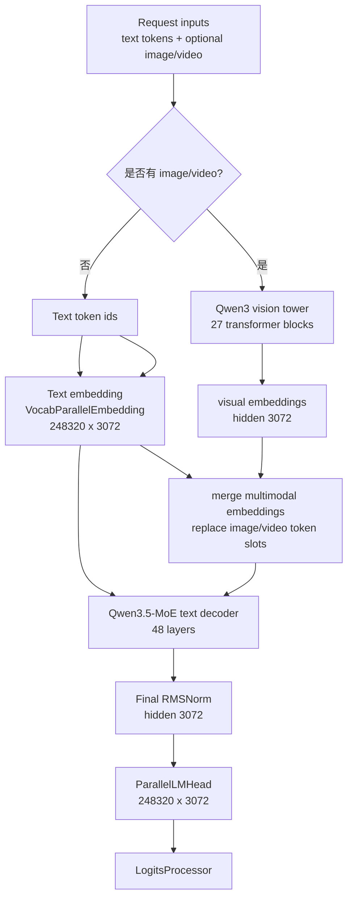

vLLM 中对应的类关系：

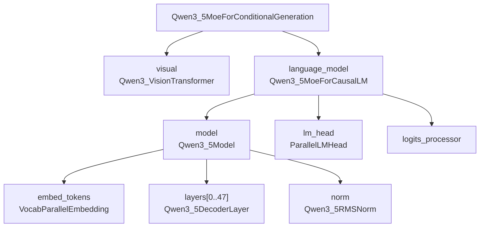

### Vision tower

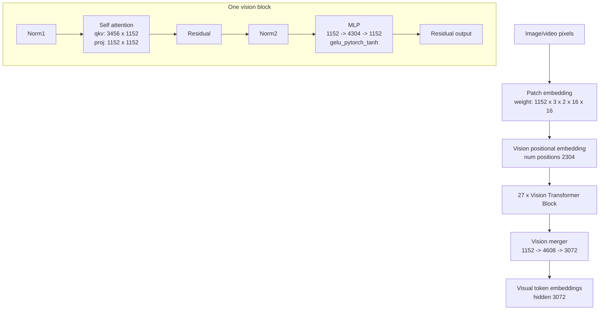

### Text decoder stack

Qwen3.5-MoE text 有 48 层。`layer_types` 是固定周期：

```text
[linear, linear, linear, full] x 12
```

也就是 full attention 层为：

```text
3, 7, 11, 15, 19, 23, 27, 31, 35, 39, 43, 47
```

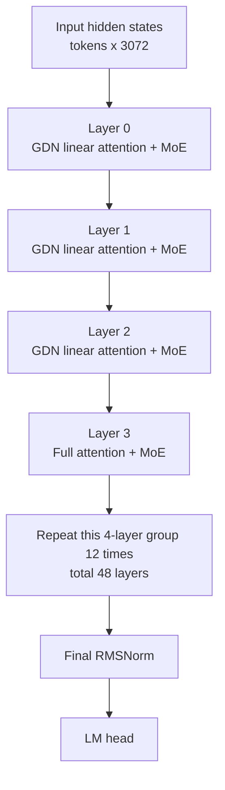

每个 decoder layer 的主干如下：

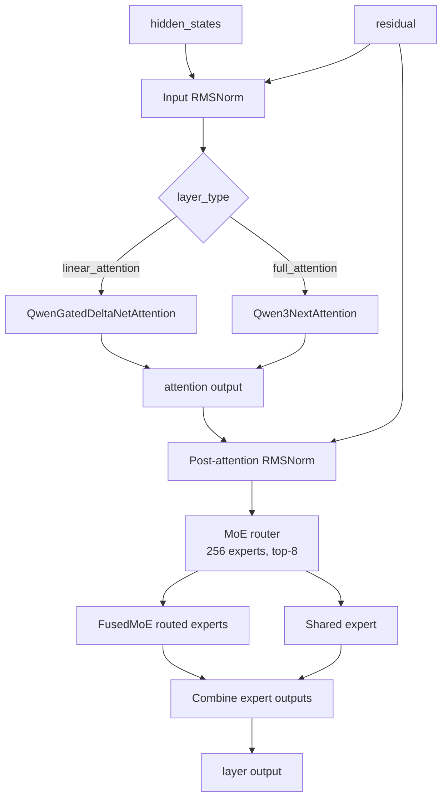

### GDN linear attention layer

GDN linear attention 层出现在 36 个 `linear_attention` layer 中。

实际权重形状示例来自 layer 0：

| 权重 | shape |
| --- | --- |
| `linear_attn.in_proj_qkv.weight` | `[12288, 3072]` |
| `linear_attn.in_proj_z.weight` | `[8192, 3072]` |
| `linear_attn.in_proj_b.weight` | `[64, 3072]` |
| `linear_attn.in_proj_a.weight` | `[64, 3072]` |
| `linear_attn.conv1d.weight` | `[12288, 1, 4]` |
| `linear_attn.out_proj.weight` | `[3072, 8192]` |
| `linear_attn.A_log` | `[64]` |
| `linear_attn.dt_bias` | `[64]` |
| `linear_attn.norm.weight` | `[128]` |

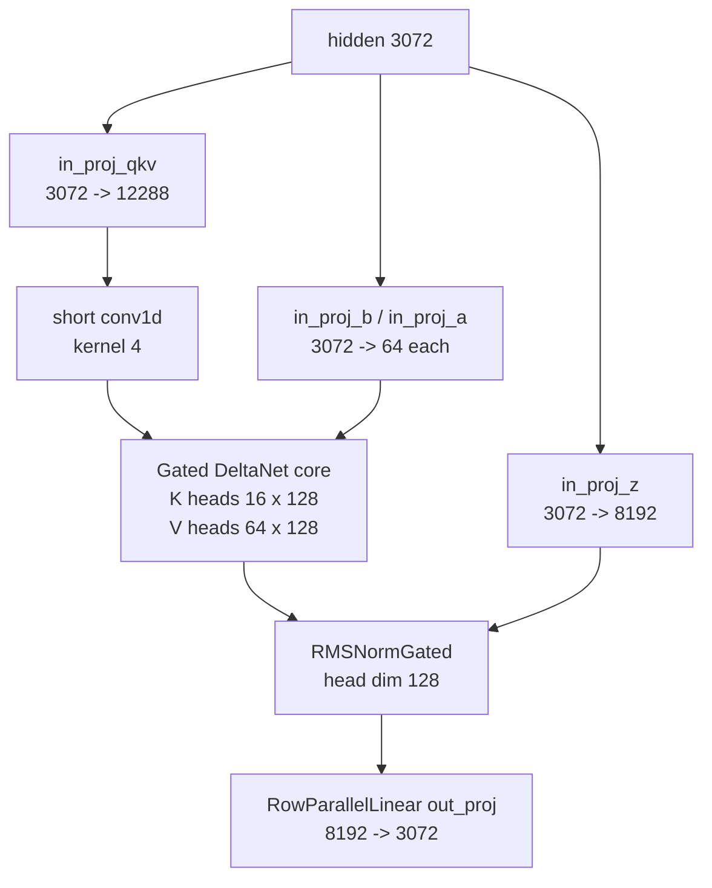

PR #47006 改的 `reduce_results` 就落在最后的 `out_proj` 节点上。

### Full attention layer

Full attention 层出现在 12 个 layer 中。

实际权重形状示例来自 layer 3：

| 权重 | shape |
| --- | --- |
| `self_attn.q_proj.weight` | `[16384, 3072]` |
| `self_attn.k_proj.weight` | `[512, 3072]` |
| `self_attn.v_proj.weight` | `[512, 3072]` |
| `self_attn.o_proj.weight` | `[3072, 8192]` |
| `self_attn.q_norm.weight` | `[256]` |
| `self_attn.k_norm.weight` | `[256]` |

这里 `q_proj` 输出是 `32 heads x 256 head_dim x 2`，多出来的 2 倍来自 `attn_output_gate=True`：Q 和 output gate 一起投影。

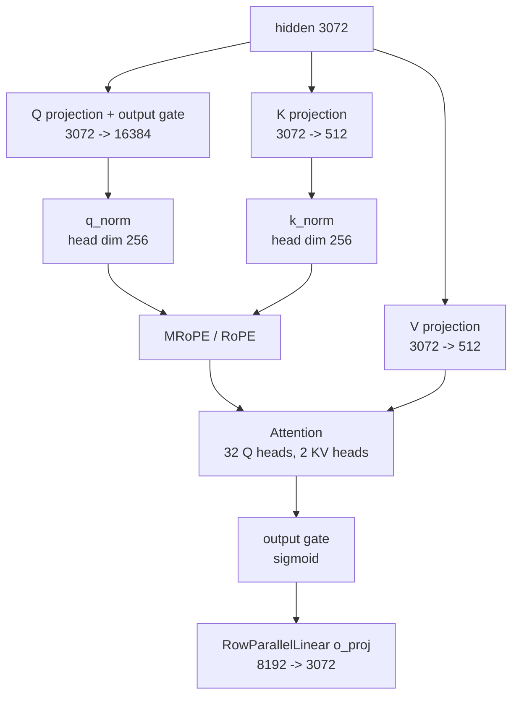

PR #47006 改的 `reduce_results` 就落在最后的 `o_proj` 节点上。

### MoE block

Qwen3.5-122B-A10B 的 48 个 text layer 都是 MoE layer。每层有 256 个 routed experts，每个 token 选 top-8 routed experts，同时还有一个 shared expert。

实际权重形状示例来自 layer 0：

| 权重 | shape |
| --- | --- |
| `mlp.gate.weight` | `[256, 3072]` |
| `mlp.experts.gate_up_proj` | `[256, 2048, 3072]` |
| `mlp.experts.down_proj` | `[256, 3072, 1024]` |
| `mlp.shared_expert.gate_proj.weight` | `[1024, 3072]` |
| `mlp.shared_expert.up_proj.weight` | `[1024, 3072]` |
| `mlp.shared_expert.down_proj.weight` | `[3072, 1024]` |
| `mlp.shared_expert_gate.weight` | `[1, 3072]` |

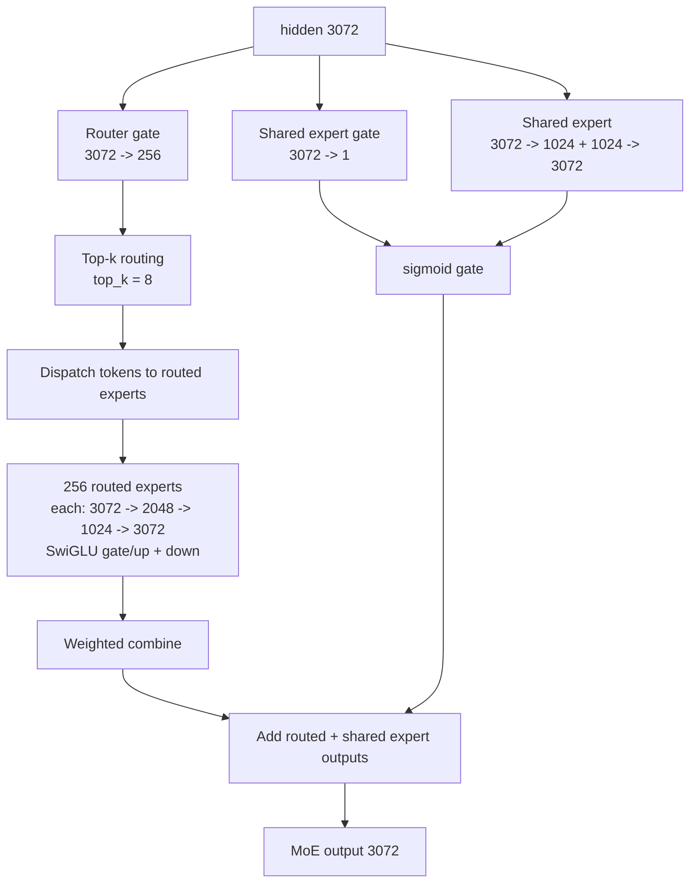

PR #47006 改的 `already_sequence_parallel=True` 就落在 MoE block 的入口：当 decoder layer 已经通过 reduce-scatter 得到 token shard 时，MoE 直接消费 shard，不再自己 `sequence_parallel_chunk`，也不在出口立刻 all-gather。

## 旧路径

修改前，attention 的输出投影 `RowParallelLinear` 默认会做 TP all-reduce。这样每个 TP rank 都拿到完整 attention output。随后 MoE block 又会因为开启了 sequence-parallel MoE，把完整 token tensor 切成本 rank 的 token shard。

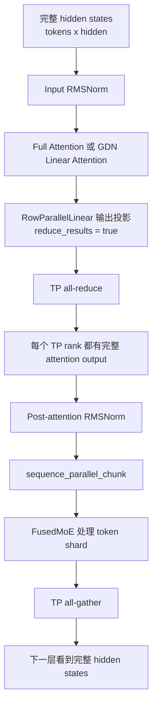

这里的问题是 attention 和 MoE 边界上发生了重复的数据形态转换：

1. attention output projection 先 all-reduce 到完整 hidden states。
2. MoE 入口马上又 `sequence_parallel_chunk` 成 token shard。

也就是：

```text
TP partial output -> all-reduce -> full tokens -> chunk -> token shard
```

PR #47006 要把这段改成更直接的：

```text
TP partial output -> reduce-scatter -> token shard
```

## 新路径

新路径只在三个条件同时满足时启用：

1. `parallel_config.use_sequence_parallel_moe` 为 true。
2. `parallel_config.pipeline_parallel_size == 1`。
3. 当前 decoder layer 的 MLP 部分确实是 MoE。

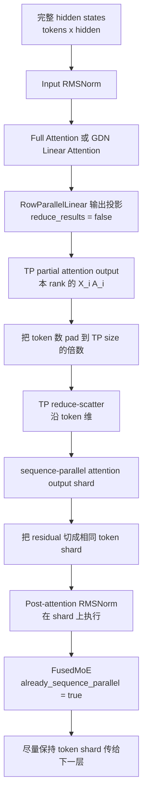

这个图对应 PR 的主要改动：attention output projection 不再自己 all-reduce，而是把通信决策交给 decoder layer。decoder layer 知道下一步是不是 MoE，所以它可以在 attention 和 MoE 的边界上选择 reduce-scatter。

## 回退路径

不是所有位置都能一直保持 token shard。attention 本身需要完整 token 维；非 MoE 层也不一定能消费 shard；aux hidden state 和最终 norm/logits 也需要完整 hidden states。

所以 PR 还加了一条回退路径：只要 shard 状态离开可优化区域，就 all-gather 回完整 token。

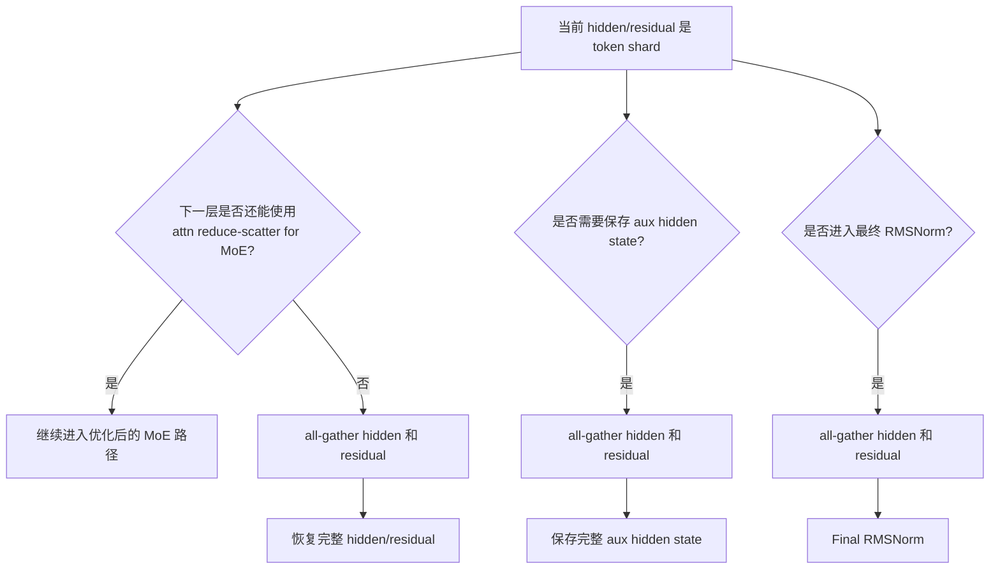

这就是为什么 PR 里除了 reduce-scatter，还会看到若干 all-gather：它们不是把优化抵消掉，而是在模型需要完整 token 的边界上恢复正确的数据形态。

## 修改点到架构图的映射

### 1. 引入 reduce-scatter 原语

文件：`vllm/model_executor/models/qwen3_next.py`

```python
tensor_model_parallel_reduce_scatter,
```

位置：新路径图里的 `TP partial attention output -> TP reduce-scatter -> token shard`。

原因：旧代码只有 all-gather/all-reduce 类路径。现在需要把 TP partial output 求和，同时按 token 维 scatter 给各 TP rank，所以必须引入 `tensor_model_parallel_reduce_scatter`。

### 2. MoE block 增加 already_sequence_parallel 参数

文件：`vllm/model_executor/models/qwen3_next.py`

```python
def forward(
    self,
    hidden_states: torch.Tensor,
    already_sequence_parallel: bool = False,
) -> torch.Tensor:
```

位置：新路径图里的 `FusedMoE already_sequence_parallel = true`。

原因：过去 MoE block 默认认为自己收到的是完整 token tensor，所以开启 sequence-parallel MoE 时会自己调用 `sequence_parallel_chunk`。新路径下，decoder layer 已经通过 reduce-scatter 得到了 token shard，MoE 不能再切一次。

对应改动：

```python
if self.is_sequence_parallel and not already_sequence_parallel:
    hidden_states = sequence_parallel_chunk(hidden_states)
```

这行保证：只有输入还不是 SP shard 时，MoE 才负责切 token。

```python
if self.is_sequence_parallel and not already_sequence_parallel:
    final_hidden_states = tensor_model_parallel_all_gather(...)
```

这行保证：只有 MoE 自己切过 token 时，MoE 才在出口 all-gather 回完整 token。若输入已经是 SP shard，新路径会让输出继续保持 shard，避免马上聚合回去。

### 3. Full attention 的 o_proj 支持跳过 all-reduce

文件：`vllm/model_executor/models/qwen3_next.py`

```python
reduce_results: bool = True,
```

位置：新路径图里的 `RowParallelLinear 输出投影 reduce_results = false`。

原因：`Qwen3NextAttention.o_proj` 是 attention 结束后从 head/output projection 回到 hidden size 的位置，也是 TP partial result 默认 all-reduce 的位置。

对应改动：

```python
self.o_proj = RowParallelLinear(
    ...,
    reduce_results=reduce_results,
)
```

当 `reduce_results=True` 时保持旧行为：`RowParallelLinear` 内部 all-reduce，所有 TP rank 都得到完整输出。

当 `reduce_results=False` 时保留 partial output：每个 rank 只拿到自己的 `X_i A_i`，后续由 decoder layer 显式 reduce-scatter。

### 4. GDN linear attention 的 out_proj 使用同一套契约

文件：`vllm/model_executor/layers/mamba/gdn/qwen_gdn_linear_attn.py`

```python
reduce_results: bool = True,
```

位置：新路径图里的 `Full Attention 或 GDN Linear Attention -> RowParallelLinear 输出投影`。

原因：Qwen3Next/Qwen3.5 不是只有 full attention，也可能有 GDN linear attention。两种 attention 的输出投影必须支持同样的 `reduce_results` 语义，否则只有 full attention 层能进入新路径。

对应改动：

```python
self.out_proj = RowParallelLinear(
    ...,
    reduce_results=reduce_results,
)
```

这样 GDN linear attention 的输出也可以选择跳过内部 all-reduce。

### 5. Qwen3Next decoder layer 判断自己是否能启用新路径

文件：`vllm/model_executor/models/qwen3_next.py`

```python
mlp_only_layers = (
    [] if not hasattr(config, "mlp_only_layers") else config.mlp_only_layers
)
is_moe_layer = (self.layer_idx not in mlp_only_layers) and (
    config.num_experts > 0
    and (self.layer_idx + 1) % config.decoder_sparse_step == 0
)
```

位置：decoder layer 内部，attention 和 MLP/MoE 构造之前。

原因：Qwen3Next 的 MoE 不是每层都有，某些层是普通 MLP。只有当前层的 FFN 部分是 MoE，attention output 才应该直接 reduce-scatter 成 MoE 需要的 token shard。

```python
self.use_attn_reduce_scatter_for_moe = (
    parallel_config.use_sequence_parallel_moe
    and parallel_config.pipeline_parallel_size == 1
    and is_moe_layer
)
```

位置：新路径开关。

原因：

1. 没开 `use_sequence_parallel_moe` 时，MoE 不需要 token shard。
2. `pipeline_parallel_size > 1` 时，跨 PP stage 传递 shard 状态需要额外边界处理，所以 PR 保守禁用。
3. 当前层不是 MoE 时，reduce-scatter 出来的 token shard 没有直接消费者。

### 6. 根据 layer 决策设置 attention projection 的 reduce_results

文件：`vllm/model_executor/models/qwen3_next.py`

```python
reduce_results=not self.use_attn_reduce_scatter_for_moe,
```

位置：构造 `QwenGatedDeltaNetAttention` 和 `Qwen3NextAttention` 时。

原因：decoder layer 是唯一同时知道“当前 attention 后面是不是 MoE”和“parallel config 是否允许优化”的地方。因此由 decoder layer 决定 attention output projection 是否跳过内部 all-reduce。

图上对应：

```text
use_attn_reduce_scatter_for_moe = false:
    RowParallelLinear reduce_results=true -> all-reduce -> full hidden

use_attn_reduce_scatter_for_moe = true:
    RowParallelLinear reduce_results=false -> partial output -> reduce-scatter
```

### 7. Decoder layer 把 partial attention output 转成 token shard

文件：`vllm/model_executor/models/qwen3_next.py`

```python
full_num_tokens = positions.shape[-1]
input_is_sequence_parallel = (
    self.use_attn_reduce_scatter_for_moe
    and residual is not None
    and hidden_states.shape[0] != full_num_tokens
)
```

位置：decoder layer forward 开始。

原因：`positions` 仍然描述完整 token 数。通过比较 `hidden_states.shape[0]` 和 `full_num_tokens`，可以知道当前输入是不是上一层留下来的 token shard。

```python
if input_is_sequence_parallel:
    hidden_states = tensor_model_parallel_all_gather(hidden_states, 0)
    hidden_states = hidden_states[:full_num_tokens]
```

位置：进入 attention 前。

原因：attention 需要完整 token 维。如果上一层输出还是 shard，这里必须先 all-gather 回完整 hidden states。

```python
sp_pad = (-hidden_states.shape[0]) % tp_world_size
hidden_states = torch.nn.functional.pad(hidden_states, (0, 0, 0, sp_pad))
hidden_states = tensor_model_parallel_reduce_scatter(hidden_states, 0)
```

位置：attention 输出之后、post-attention RMSNorm 之前。

原因：这是 PR 的核心数据流改动。reduce-scatter 按 token 维切分，token 数需要能被 TP size 整除，所以先 pad。然后把 TP partial outputs 做 reduce，并把 token shard scatter 到各 rank。

```python
if not input_is_sequence_parallel:
    residual = sequence_parallel_chunk(residual)
```

位置：reduce-scatter 之后。

原因：`hidden_states` 已经是 token shard，`residual` 也必须切成相同 token shard，后面的 post-attention RMSNorm 才能在相同 shape 上执行。

```python
hidden_states = self.mlp(
    hidden_states,
    already_sequence_parallel=True,
)
```

位置：进入 MoE 时。

原因：告诉 MoE：输入已经是 sequence-parallel shard，不要重复 chunk，也不要在 MoE 结束后立即 all-gather。

### 8. 增加 hidden/residual 一起 all-gather 的辅助函数

文件：`vllm/model_executor/models/qwen3_next.py`

```python
def _all_gather_hidden_and_residual(...):
```

位置：回退路径图里的 `all-gather hidden 和 residual`。

原因：当 shard 状态要离开优化区域时，需要恢复完整 hidden/residual。

```python
combined_states = torch.cat([hidden_states, residual], dim=-1)
combined_states = tensor_model_parallel_all_gather(combined_states, 0)
hidden_states, residual = combined_states.split([hidden_size, hidden_size], dim=-1)
```

原因：hidden 和 residual 都存在时，把它们在 hidden 维拼起来，一次 all-gather 后再 split。这样比对 hidden 和 residual 各做一次 all-gather 少一次 collective 调用。

### 9. Model forward 在边界上恢复完整 token

文件：`vllm/model_executor/models/qwen3_next.py`

```python
if (
    hidden_states.shape[0] != full_num_tokens
    and not layer.use_attn_reduce_scatter_for_moe
):
    hidden_states, residual = _all_gather_hidden_and_residual(...)
```

位置：进入每一层之前。

原因：如果上一层留下 token shard，但下一层不能使用新路径，就必须恢复完整 token。否则普通层或非 MoE 层会收到错误 shape。

```python
if (layer_idx + 1) in self.aux_hidden_state_layers and hidden_states.shape[0] != full_num_tokens:
    hidden_states, residual = _all_gather_hidden_and_residual(...)
```

位置：保存 aux hidden state 之前。

原因：aux hidden state 语义上应该是完整 hidden states，不能只保存当前 TP rank 的 token shard。

```python
if hidden_states.shape[0] != full_num_tokens:
    hidden_states, residual = _all_gather_hidden_and_residual(...)
```

位置：最终 RMSNorm 之前。

原因：最后的 norm 和 logits 路径需要完整 token 维，所以模型出口前必须恢复完整 hidden states。

### 10. Qwen3.5-MoE 接入同一套 decoder-layer 路径

文件：`vllm/model_executor/models/qwen3_5.py`

```python
is_moe_layer = config.model_type == "qwen3_5_moe_text"
```

位置：`Qwen3_5DecoderLayer.__init__`。

原因：Qwen3.5 普通 text 模型用普通 MLP；Qwen3.5-MoE text 模型用 sparse MoE。这里通过 model type 判断当前 decoder layer 是否应该走 MoE 优化路径。

```python
self.use_attn_reduce_scatter_for_moe = (
    parallel_config.use_sequence_parallel_moe
    and parallel_config.pipeline_parallel_size == 1
    and is_moe_layer
)
```

原因：Qwen3.5-MoE 和 Qwen3Next 使用同一套启用条件。

```python
reduce_results=not self.use_attn_reduce_scatter_for_moe,
```

位置：构造 Qwen3.5 的 GDN linear attention 和 full attention 时。

原因：Qwen3.5 继承了 `Qwen3NextDecoderLayer.forward` 的执行逻辑，所以它只需要在构造阶段把 `use_attn_reduce_scatter_for_moe` 和 `reduce_results` 设置正确，就能复用同一套 reduce-scatter -> MoE shard 路径。

## 总结图

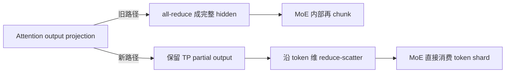

PR #47006 改的是 attention 和 MoE 之间的通信边界。核心性能收益来自把 `all-reduce + chunk` 替换成 `reduce-scatter`。其余修改主要是边界保护：判断哪些层能走新路径，在 attention/final norm/aux hidden state 需要完整 token 时恢复 full hidden states，并保持非 MoE 或未启用 sequence-parallel MoE 时的旧行为。
