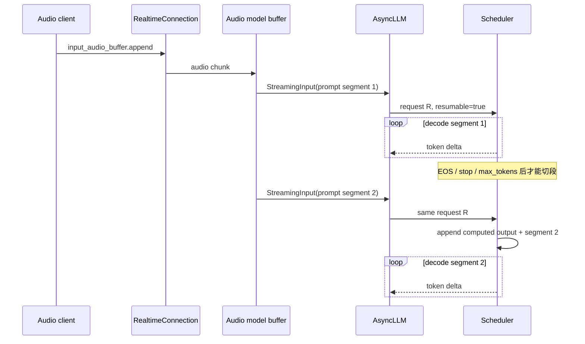
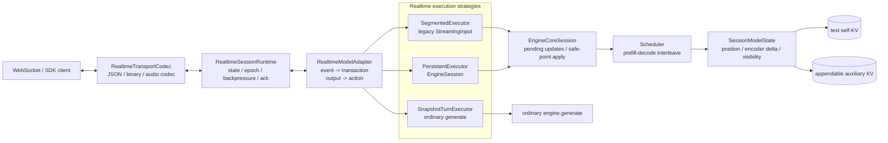
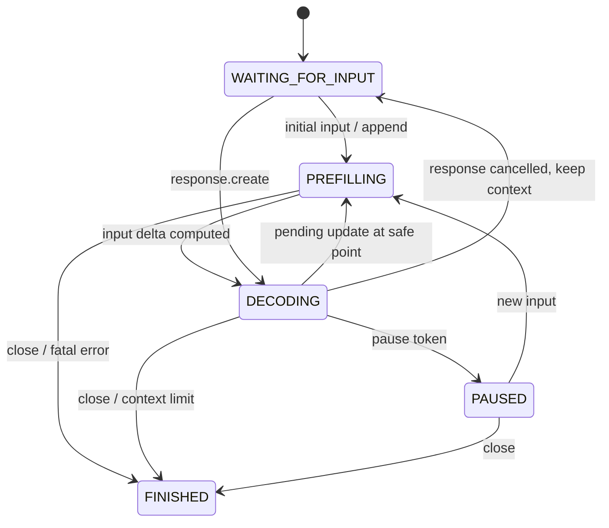
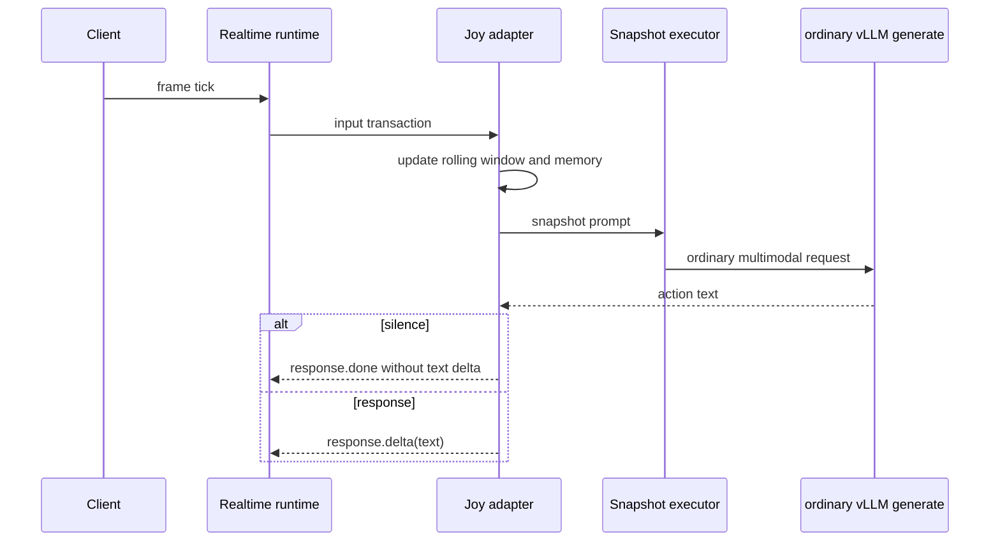

# vLLM Realtime Multimodal Session 设计：从音频分段续跑到实时视觉会话

> 状态：Design proposal / 调研结论，不是已实现功能
>
> 调研时间：2026-07-15
>
> 主要参考：当前 vLLM realtime、MOSS-VL-Realtime HF 实现、MOSS-VL 示例服务、
> vLLM-Omni Joy-VL fullduplex 实验实现

## 1. 结论先行

MOSS-VL realtime 不能通过给现有 `SupportsRealtime` 增加一个
`buffer_realtime_video()` 方法完成接入。当前 vLLM realtime 的本质是：

1. 前端把连续音频切成若干独立 prompt；
2. 每个 prompt 用同一个 request id 提交；
3. 当前子请求生成到 EOS、stop token 或 `max_tokens` 后，scheduler 才把下一段
   prompt 接到已有上下文后继续生成。

这是一种 **segmented resumable request（分段续跑请求）**，并不是真正可在解码中
追加输入的双工 session。它适合当前 Qwen3-ASR 和 Voxtral Realtime 的音频分块，
但 MOSS-VL 要求在逐 token 解码过程中接收帧和用户 prompt，并在下一个安全的模型
step 同时做到：

- 把刚生成的 token 保留到文本上下文；
- 追加时间戳文本、图像占位符和用户文本；
- 只编码新帧；
- 向一条独立于 text self-KV 的 vision cross-KV 序列追加 K/V；
- 为新文本和新视觉 token 计算增量 3D XRoPE/MRoPE position；
- 保持“文本只能看到在它之前到达的帧”的 causal cross-attention visibility；
- 遇到模型定义的 silence token 时暂停而不是结束并释放 session，收到新输入后恢复。

与此同时，Joy-VL 当前采用的是另一种合理范式：每个 frame/tick 构造一个普通的
多模态请求，通过滚动窗口、prefix cache 和分层 memory 控制成本。它不需要可变的
in-request vision cache。

因此建议把 realtime 设计为共享控制面、允许多种执行策略的数据面：

| 执行策略 | 代表模型 | 输入何时生效 | 状态保存方式 | 需要的引擎能力 |
|---|---|---|---|---|
| `SEGMENTED` | Qwen3-ASR、当前 Voxtral | 当前生成停止后 | 同 request id 分段续跑 | 现有 `StreamingInput` 即可 |
| `PERSISTENT_APPEND` | MOSS-VL Realtime | 任意 decode step 后的安全点 | text KV 与可追加 auxiliary KV | 运行中更新、可增长 cross-KV、pause/resume |
| `SNAPSHOT_TURN` | Joy-VL | 每个 tick 发起一次新请求 | 滚动 prompt、prefix cache、外部 memory | 普通 `generate()` 即可 |

统一的是 event、session、response epoch、背压、取消和输出协议；不应为了表面统一，
让 Joy-VL 被迫使用持久 cross-KV，也不应让 MOSS-VL 退化成每帧重算完整窗口。

## 2. 调研范围

### 2.1 vLLM 当前实现

- [`SupportsRealtime`](../../vllm/model_executor/models/interfaces.py)
- [`StreamingInput`](../../vllm/engine/protocol.py)
- [`RealtimeConnection`](../../vllm/entrypoints/speech_to_text/realtime/connection.py)
- [`OpenAIServingRealtime`](../../vllm/entrypoints/speech_to_text/realtime/serving.py)
- [`AsyncLLM._add_streaming_input_request`](../../vllm/v1/engine/async_llm.py)
- [`Request` / `StreamingUpdate`](../../vllm/v1/request.py)
- [`Scheduler`](../../vllm/v1/core/sched/scheduler.py)
- [`CrossAttention`](../../vllm/model_executor/layers/attention/cross_attention.py)
- [`EncoderDecoderModelState`](../../vllm/v1/worker/gpu/model_states/encoder_decoder.py)
- [`CrossAttentionManager`](../../vllm/v1/core/single_type_kv_cache_manager.py)
- [streaming scheduler tests](../../tests/v1/streaming_input/test_scheduler_streaming.py)

### 2.2 MOSS-VL

- [MOSS-VL realtime README](../../../MOSS-VL/realtime_inference/README.md)
- [MOSS-VL realtime 示例服务](../../../MOSS-VL/realtime_inference/run_online_inference.py)
- HF checkpoint：
  `/mnt/data1/huggingface/hub/models--OpenMOSS-Team--MOSS-VL-Realtime/`
  `snapshots/8af1f0c370055904d74cbe8df728a0850c2f67ff/`
  `modeling_moss_vl.py`、`processing_moss_vl.py`
- MOSS-VL 仓库内已有 SGLang offline 模型与 processor 实现，作为 cross-attention
  mask 和位置处理的旁证；它目前不是 MOSS realtime session 的直接实现。

### 2.3 Joy-VL / vLLM-Omni

用户给出的目录名 `fulldex` 在当前 checkout 中实际为：

`/root/vllm-omni-workspace/vllm-omni/vllm_omni/experimental/fullduplex/`

重点查看：

- `core/adapter.py`、`core/protocol.py`、`core/runtime.py`、`core/session.py`
- `joyvl/adapter.py`
- `joyvl/serving/session.py`
- `recipes/JD/JoyAI-VL-Interaction.md`

## 3. vLLM 当前 realtime 到底做了什么

### 3.1 API 和模型接口仍然是 audio transcription 专用

当前路由位于 `entrypoints/speech_to_text/realtime`，协议只接受：

- `session.update`：只校验 model；
- `input_audio_buffer.append`：base64 PCM16，固定按 16 kHz 解释；
- `input_audio_buffer.commit`：启动生成或发送结束 sentinel；
- 输出 `transcription.delta` / `transcription.done`。

模型能力接口也把 realtime 等同于 audio：

```python
class SupportsRealtime(Protocol):
    supports_realtime: ClassVar[Literal[True]] = True
    realtime_max_tokens: ClassVar[int] = 1

    @classmethod
    async def buffer_realtime_audio(
        cls,
        audio_stream: AsyncGenerator[np.ndarray, None],
        input_stream: asyncio.Queue[list[int]],
        model_config: ModelConfig,
    ) -> AsyncGenerator[PromptType, None]: ...
```

这使 transport、音频解码、模型 prompt 构造、输出反馈和 engine session 语义混在了
一个接口中。增加视频后如果继续复制，会出现
`buffer_realtime_video()`、`frame_queue`、`prompt_queue` 等 model-specific 分支。

### 3.2 `StreamingInput` 是 prompt stream，不是通用 session update

```python
@dataclass
class StreamingInput:
    prompt: EngineInput
    sampling_params: SamplingParams | None = None
```

`AsyncLLM` 消费 async generator，把每个元素重新走一次完整 `InputProcessor`，创建
`resumable=True` 且具有相同内部 request id 的 `EngineCoreRequest`。input generator
关闭时，再发送一个 dummy non-resumable request 作为 session 结束信号。

`StreamingUpdate` 只保留：

- `prompt_token_ids`
- `mm_features`
- `sampling_params` / `max_tokens`
- `arrival_time`

它表达的是“下一段 prompt”，不能表达：

- 一个由 text + frame 组成的原子 transaction；
- 输入序号、时间戳、水位线和 ack；
- pause、resume、cancel-response-but-keep-context；
- 新增 auxiliary KV 的长度与可见性；
- 当前 running decode 应如何接入更新。

### 3.3 scheduler 只在子请求停止后应用下一段输入

当同 request id 的新请求到达时：

- session 若为 `WAITING_FOR_STREAMING_REQ`，立即调用
  `_update_request_as_session()`；
- 否则只放入 `request.streaming_queue`；
- 只有 `_handle_stopped_request()` 被调用，即当前子请求已停止时，才取下一项更新。

`_update_request_as_session()` 保留已经 computed 的输出 token，丢掉最后一个尚未
computed 的 sampled token，追加新 prompt 和 MM feature，再把 request 放回
`WAITING`。这种行为服务于“多个有限 generation 串起来”，而不是持续自回归会话。



### 3.4 两个现有模型实际也不是同一种 audio realtime

Qwen3-ASR realtime 每累计约 5 秒音频就产生一个完整 audio prompt，并为 realtime
单独注册 processor/model subclass。其 `input_stream` 参数目前未被使用。

Voxtral Realtime 更接近流式自回归：根据 look-back/look-ahead 音频窗口和 token
节奏构造小 prompt，并把上轮生成 token 反馈给下一轮输入。但在 engine 看来仍是
若干必须先停止再续跑的子请求。

这说明现有 `SupportsRealtime` 已把两种不同的模型行为藏在一个 audio buffer API
后面；继续在该接口上扩展视觉只会加重耦合。

### 3.5 现有 cross-attention cache 也是“一次性 encoder”语义

vLLM 已有 `CrossAttention`、`CrossAttentionSpec`、
`EncoderDecoderModelState` 和 `CrossAttentionManager`，但关键假设是：

1. encoder states 对一个 request 唯一；
2. encoder 只在 request 开始时计算一次；
3. cross K/V 在第一个 decoder step 一次性写入；
4. 后续 decode 只读固定长度的 cross KV；
5. cross-attention blocks 按 `num_encoder_tokens` 做一次静态分配；
6. scheduler 对 encoder-decoder MM input 假设 `start_pos == 0`，一旦已有 decoder
   computed token 就跳过 encoder input。

`CrossAttentionBuilder` 甚至通过“decoder 是否已有 computed token”推断 cross KV
是否已经写过。这个推断对追加新 frame 的 session 不成立。

### 3.6 当前能力与 MOSS 需求的差距矩阵

| 维度 | vLLM 当前 realtime | MOSS-VL realtime 需要 | 应落入的通用抽象 |
|---|---|---|---|
| wire input | PCM16 audio JSON | text、JPEG/PNG frame、timestamp、原子组合 | modality-neutral event + codec |
| update 时机 | 子请求 stop 后 | 任意 decode step 后 | scheduler safe-point update |
| generation 生命周期 | 每段有限生成 | session 内 pause/resume | response 与 session 生命周期分离 |
| token 顺序 | 丢弃末尾未 computed sampled token，再接新段 | sampled token 后接外部输入 | 显式 append policy |
| MM encoder | prompt window 内一次计算 | 每次只编码新 frame | incremental auxiliary source |
| cross KV | request 开始时静态写一次 | 随 frame 持续增长 | appendable cross-attention cache |
| cache 长度 | text `num_computed_tokens` 为主 | text 与 vision 两条长度轴 | per-source sequence state |
| position | 普通 position 或一次性 MM position | text/vision 3D position 增量连续 | worker position planner |
| visibility | fixed/full encoder visibility | 每个 text query 看 vision prefix | prefix-length visibility |
| model control | EOS/stop/max tokens | silence=pause，输入=唤醒 | token action policy |
| concurrency | scheduler 可 batch 分段 request | 多持久 VL session | per-request state，禁止全局 model flag |
| overload | audio queue，无通用策略 | stale frame 应丢、text 不能丢 | per-modality backpressure |

## 4. MOSS-VL realtime 的真实执行语义

### 4.1 不要把 HF reference 的 thread/queue 直接搬进 vLLM

HF checkpoint 中的 `MossVLRealtimeSession` 使用：

- frame queue、prompt queue、output queue；
- 一个 generation worker thread；
- model 上的全局 `continue_generating` 标志；
- batch size 1；
- silence 时在生成循环内等待新输入。

这是正确描述模型语义的 reference，但不是适合 vLLM 的 serving 架构。直接移植会让
一个模型实例只能安全服务一个 session，也绕过 continuous batching、scheduler、
KV block 管理和抢占。

应该移植的是其 **增量状态转换规则**，而不是 Python thread 和 queue。

### 4.2 每个 step 后都可能插入外部输入

MOSS 的 realtime generation loop 在生成一个 token 后 drain frame/prompt queue。
若有输入，则顺序大致是：

1. 把刚 sampled 的 token 追加到运行中的文本序列；
2. 对用户 prompt 追加新的 ChatML user/assistant turn；
3. 对每帧追加：
   `<|vision_start|><|time_start|>{t:.1f} seconds<|time_end|>`
   `<|image|><|vision_end|>`；
4. 只对新帧运行 processor 和 vision tower；
5. 下一次 forward 同时消费新增文本和新增视觉 states；
6. 再回到逐 token decode。

这要求 engine 在 running request 的 step boundary 接入更新，不能等待一次 generation
完成。

### 4.3 有两条独立增长的 cache 轴

MOSS-VL text decoder 中只有部分 layer 是 cross-attention layer。它维护：

- `text self-KV`：按文本 token 位置增长；
- `vision cross-KV`：按视觉 token 位置增长，每个新 frame 只追加新的视觉 K/V。

新 frame 不应重新投影历史 frame 的 cross K/V。无新 frame 的 decode step 不传
`cross_attention_states`，cross-attention layer 直接读取已经缓存的 vision K/V。

当前 vLLM request 主要用 `num_computed_tokens` 描述 text 轴；encoder cache 与
cross-attention block allocation 都没有“本次新增多少、累计多少”的独立状态。

### 4.4 position 不是简单的 `arange`

MOSS 使用共享 3D XRoPE/MRoPE：

- 新增普通文本沿统一 position 递增；
- image placeholder 处会根据 frame 的 `(t, h, w)` grid 推进 position；
- 新视觉 token 获得 3D position；
- image separator 与文本 placeholder 的 position 也参与推进；
- 必须保存 `realtime_next_position`，使后续 frame/prompt 的 position 连续。

因此，input update 不能只把 `prompt_token_ids` 拼到 list 尾部，然后让通用 runner
按线性位置推断。

### 4.5 cross-attention 需要时间因果可见性

processor 的规则是：文本位置 `t` 只能看到在 `t` 之前已经出现 image placeholder
的 frame。HF reference 构造 `(B, 1, text_len, num_frames)` 的 frame-level mask，
再按每帧视觉 token 长度扩展为 token-level mask。

对 engine 更合适的表示不是长期保存 dense mask，而是为每个 query token 保存：

> 它能看到 auxiliary sequence 的前多少个 token。

MOSS 的 frame 按到达顺序 append，因此可见集合始终是 vision sequence 的一个前缀。
可用 `visible_aux_prefix_len` 表示，必要时由 attention backend 展开为 custom mask。

### 4.6 silence 是 pause，不是普通 EOS

MOSS 输出 `<|silence|>` 后，在没有新输入时等待；收到新 frame/prompt 后沿同一个
context 继续。将它配置成普通 stop token 会使 vLLM 完成 request 并释放状态；忽略
它又会让 scheduler 空转生成。

框架需要通用的 `PAUSE_FOR_INPUT` finish/action 语义，但具体哪个 token 触发 pause
应由 model adapter 配置，core 不应硬编码 MOSS token。

## 5. Joy-VL 给出的另一种 realtime VL 范式

vLLM-Omni `fullduplex/core` 的几个控制面抽象值得保留：

- `input.append` / `input.commit`
- `response.create` / `response.cancel`
- session state
- response index 与 epoch
- barge-in 后丢弃旧 epoch 的 stale output
- model adapter 声明 input/output modalities 和 proactive 能力

但当前 runnable Joy-VL serving 并没有使用持久 engine request。其行为是：

1. 每个 tick 收集一组 frame；
2. 将 timestamp、frame 和可能的 query 加入 working chunk；
3. 构造完整 OpenAI chat messages；
4. 发起普通 vLLM generation；
5. 解析 `silence` / `response` / `delegate` action；
6. 通过滚动 frame window、prefix cache 和分层 summary memory 控制长度。

这类标准 VLM 即使没有 appendable cross-KV，也可以低成本接入 realtime 控制面。
因此通用框架必须允许 Joy-VL 只实现 snapshot adapter，而不要求修改模型 forward 或
scheduler。

## 6. 设计原则

1. **Realtime 是 session 能力，不是 audio task 的别名。**
2. **协议事件与 engine update 分层。** 网络帧、base64 音频不进入 scheduler 类型。
3. **控制面统一，执行策略可替换。** 分段、持久追加、快照请求都是一等策略。
4. **输入 transaction 原子化。** prompt + frame 必须能在同一个逻辑位置生效。
5. **外部输入只在 scheduler safe point 应用。** 不修改正在执行的 GPU batch。
6. **cache 以 sequence/source 描述，不以 image、audio 等 modality 写死。**
7. **模型只提供增量规则。** queue、线程、WebSocket、batching 由框架负责。
8. **模型控制 token 映射为通用 action。** core 认识 pause/cancel，不认识
   `<|silence|>`。
9. **先保证确定性事件顺序，再优化吞吐。** 每个输入和输出都带 sequence/watermark。
10. **有限 realtime 与无限流分开。** 第一版明确 context 上限和关闭语义，不假装
    已解决无限视觉记忆。

## 7. 目标架构



建议分为四层：

1. transport/protocol：只负责 wire event 与二进制 payload；
2. session runtime：负责 session 状态、response epoch、队列与 backpressure；
3. model adapter/executor：负责模型语义和执行策略选择；
4. engine data plane：对需要持久追加的模型提供 running update 和多轴 cache。

## 8. 通用协议与控制面

### 8.1 Client event

建议将实现从 `entrypoints/speech_to_text/realtime` 移到
`entrypoints/realtime`，协议核心为：

```python
class SessionUpdateEvent(BaseModel):
    type: Literal["session.update"]
    model: str | None = None
    config: RealtimeSessionConfig | None = None


class RealtimeInputPart(BaseModel):
    modality: str
    timestamp: float | None = None
    data: JsonValue | BinaryRef
    metadata: dict[str, JsonValue] = Field(default_factory=dict)


class InputAppendEvent(BaseModel):
    type: Literal["input.append"]
    sequence_no: int
    transaction_id: str | None = None
    parts: list[RealtimeInputPart]


class InputCommitEvent(BaseModel):
    type: Literal["input.commit"]
    through_sequence_no: int | None = None


class ResponseCreateEvent(BaseModel):
    type: Literal["response.create"]
    config: RealtimeResponseConfig | None = None


class ResponseCancelEvent(BaseModel):
    type: Literal["response.cancel"]
    keep_context: bool = True


class SessionCloseEvent(BaseModel):
    type: Literal["session.close"]
```

一个 `InputAppendEvent` 的 `parts` 构成一个原子 transaction。例如 MOSS 的用户问题
和同一时刻 frame 可以放在同一个 event 中，避免 scheduler 先看到文本、下一 step
才看到图像。`transaction_id` 用于幂等、ack 和追踪，不依赖“等待未来同 id event”
判断 transaction 是否完整；否则丢包或乱序时无法知道何时可以应用。

首版不必把所有 payload 都塞入 JSON。WebSocket binary frame 可由
`RealtimeTransportCodec` 与前一个 JSON header 关联；core 只接收已解码的对象或
稳定引用。

### 8.2 Server event

```python
session.created
session.updated
input.accepted       # 已进入有界队列
input.applied        # 已在某个 engine step 生效，含 input_watermark
input.dropped        # 根据 backpressure policy 丢弃
response.created
response.delta       # modality + response_id + epoch + input_watermark
response.paused
response.done
response.cancelled
session.closed
error
```

区分 `accepted` 和 `applied` 很重要：视频 client 可以据此知道模型当前实际看到了哪一
帧，而不把“WebSocket 已收到”误认为“GPU 已消费”。

### 8.3 Backpressure

不同 modality 的正确策略不同，应由 capability/config 声明：

```python
class OverflowPolicy(Enum):
    BLOCK = "block"
    DROP_OLDEST = "drop_oldest"
    DROP_NEWEST = "drop_newest"
    COALESCE_LATEST = "coalesce_latest"


@dataclass(frozen=True)
class InputQueuePolicy:
    max_items: int
    max_bytes: int | None
    overflow: OverflowPolicy
```

推荐默认值：

- text：不丢，满时 reject/block；
- audio：通常 block，不能任意丢采样；
- video frame：`DROP_OLDEST` 或 `COALESCE_LATEST`，避免模型持续处理过期画面。

MOSS reference 的 bounded frame queue/drop-oldest 可以由此表达，不需要 MOSS 专用
queue。

### 8.4 Session runtime

借鉴 fullduplex 的 epoch 机制，但扩充为可观察状态机：

```python
class RealtimeSessionState(Enum):
    CREATED = "created"
    LISTENING = "listening"
    PREFILLING = "prefilling"
    RESPONDING = "responding"
    PAUSED = "paused"
    CLOSING = "closing"
    CLOSED = "closed"
```

新 response 或 barge-in 增加 `epoch`。网络输出带 epoch，runtime 丢弃已取消 epoch 的
迟到 token。`response.cancel(keep_context=True)` 与 engine `abort(request)` 必须分开：
前者停止当前输出但保留 session cache，后者销毁 request。

## 9. Model adapter 与执行策略接口

### 9.1 Capability

```python
class RealtimeExecutionMode(Enum):
    SEGMENTED = "segmented"
    PERSISTENT_APPEND = "persistent_append"
    SNAPSHOT_TURN = "snapshot_turn"


class ResponseMode(Enum):
    EXPLICIT = "explicit"          # response.create
    ON_COMMIT = "on_commit"        # input.commit
    CONTINUOUS = "continuous"      # 输入可唤醒暂停中的生成


@dataclass(frozen=True)
class RealtimeCapabilities:
    input_modalities: frozenset[str]
    output_modalities: frozenset[str]
    execution_mode: RealtimeExecutionMode
    response_mode: ResponseMode
    supports_barge_in: bool = False
    proactive: bool = False
    queue_policies: Mapping[str, InputQueuePolicy] = field(default_factory=dict)
```

### 9.2 Adapter

不要再让 model class 自己管理 async audio generator。建议模型注册一个 adapter
factory；adapter 运行在 API/frontend process，负责轻量、确定性的事件转换：

```python
class RealtimeModelAdapter(ABC):
    @classmethod
    def capabilities(cls, model_config: ModelConfig) -> RealtimeCapabilities: ...

    @abstractmethod
    async def create_session(
        self,
        config: RealtimeSessionConfig,
    ) -> RealtimeAdapterSession: ...


class RealtimeAdapterSession(ABC):
    @abstractmethod
    async def on_transaction(
        self,
        transaction: RealtimeInputTransaction,
    ) -> AsyncIterator[RealtimeExecutorCommand]: ...

    @abstractmethod
    def interpret_output(
        self,
        output: RequestOutput,
    ) -> list[RealtimeOutputAction]: ...

    async def on_cancel(self, keep_context: bool) -> None: ...
    async def close(self) -> None: ...
```

`RealtimeExecutorCommand` 只包含通用命令：

- `AppendInput`
- `CommitInput`
- `CreateResponse`
- `CancelResponse`
- `CloseSession`

adapter 可以知道 MOSS 的 prompt 模板、placeholder 和 control token，但 scheduler
不能。

### 9.3 三个通用 executor

#### `SegmentedRealtimeExecutor`

包装现有 `AsyncGenerator[StreamingInput]`，保持 Qwen3-ASR/Voxtral 行为。迁移期的
`LegacyAudioRealtimeAdapter` 可以调用原来的 `buffer_realtime_audio()`。

#### `PersistentRealtimeExecutor`

持有一个新的 `EngineSession`，将每个 `AppendInput` 变成运行中 request update。
用于 MOSS-VL 以及未来真正支持 interleaved input 的模型。

#### `SnapshotTurnRealtimeExecutor`

adapter 每次返回完整 `PromptType`/messages，executor 调用普通 `generate()`。
用于 Joy-VL 类模型。frame sampling、working window、summary memory 是可复用的
adapter policy，但不是 scheduler 能力。

### 9.4 注册与 processor profile

当前 Qwen3-ASR realtime 因为 multimodal registry 对一个 model class 只绑定一个
processor，被迫增加 `Qwen3ASRRealtimeGeneration` subclass。这不应成为所有 realtime
模型的接入模板。

建议独立注册 adapter，并允许 processor 有命名 profile：

```python
REALTIME_ADAPTER_REGISTRY.register(
    architecture="MossVLForConditionalGeneration",
    factory=MossVLRealtimeAdapterFactory,
)

MULTIMODAL_REGISTRY.get_processor(
    model_config,
    profile="realtime",  # 缺省时回退到 "default"
)
```

同一 execution model class 可以同时支持普通 generation 和 realtime。只有在 placeholder
扩展等预处理确实不同的情况下才注册 `realtime` processor profile；MOSS 若可复用默认
processor，就只注册 adapter/session model state，不复制模型 class。

## 10. Engine API：从单向 generate 到显式 session handle

async input generator 隐藏了 input/output 双向并发、ack、pause 和 cancel。建议新增：

```python
class EngineSession(ABC):
    request_id: str

    @abstractmethod
    async def append(self, update: SessionInputUpdate) -> InputApplyFuture: ...

    @abstractmethod
    async def create_response(
        self,
        config: SessionResponseConfig | None = None,
    ) -> int: ...

    @abstractmethod
    async def cancel_response(self, keep_context: bool = True) -> None: ...

    @abstractmethod
    def outputs(self) -> AsyncIterator[SessionOutput]: ...

    @abstractmethod
    async def close(self) -> None: ...


class EngineClient(ABC):
    async def open_session(
        self,
        request_id: str,
        initial_input: EngineInput | None,
        sampling_params: SamplingParams,
        options: EngineSessionOptions,
    ) -> EngineSession: ...
```

现有 `generate(async_generator)` 可以继续存在，并在内部用 session handle 实现
`SEGMENTED` 兼容语义。不要直接改变既有 `StreamingInput` 的停段行为，否则当前
模型和测试的 token 边界会发生隐蔽变化。

## 11. Engine core update 类型

frontend event 经过 renderer/InputProcessor 后，再形成 engine-core 类型：

```python
@dataclass(frozen=True)
class SessionInputUpdate:
    sequence_no: int
    transaction_id: str
    prompt_token_ids: list[int]
    mm_features: list[MultiModalFeatureSpec]
    sampling_params: SamplingParams | None
    append_policy: AppendPolicy = AppendPolicy.AFTER_PENDING_OUTPUT
    auxiliary_deltas: tuple[AuxiliarySequenceDelta, ...] = ()


@dataclass(frozen=True)
class AuxiliarySequenceDelta:
    source_id: str
    item_ids: tuple[str, ...]
    num_new_tokens: int
    # 每个 item 在新增 text 中的 causal anchor；worker 可转换为 token prefix length。
    visible_from_text_offsets: tuple[int, ...]
```

`source_id` 是 attention source/cache axis，如 `vision`、`audio_encoder`，不是模型名。
MOSS 的 12 个 cross-attention layer 共享 `vision` source。

`AppendPolicy.AFTER_PENDING_OUTPUT` 表示：当前 step 刚 sampled、尚未写入 self-KV 的
token 仍然位于新输入之前，下一次 prefill 会先计算该 token，再计算 transaction。
这与 MOSS HF loop 一致。现有 segmented continuation 丢弃末尾 sampled token 的行为
由 legacy executor 保持，不作为新 session API 默认值。

### 11.1 request token bookkeeping 也必须泛化

当前 `Request` 可以被理解为单一分界：

```text
[ prompt_token_ids ][ output_token_ids ]
```

而 persistent session 的实际时间线是：

```text
[input 0][output 0][input 1][output 1a][input 2][output 1b]...
```

只增加 `pending_input_updates` 而不修改这层 bookkeeping 会导致：

- `num_prompt_tokens` 无法描述中间插入的 input；
- completion token usage 与 session context token 混淆；
- response cancel 后无法知道哪些 token 已经对 client 可见；
- `max_tokens` 被错误地解释成整个 session 上限，而非当前 response 上限；
- output processor 仍假设所有输出都位于一个连续尾部。

建议 request 内部维护统一 `context_token_ids`，并用 span 记录 provenance：

```python
class SessionTokenKind(Enum):
    INPUT = "input"
    OUTPUT = "output"
    CONTROL = "control"


@dataclass(frozen=True)
class SessionTokenSpan:
    start: int
    end: int
    kind: SessionTokenKind
    input_sequence_no: int | None = None
    response_id: int | None = None
    epoch: int | None = None
```

scheduler 只需要线性的 `context_token_ids`；output processor 和 usage 通过 span 区分
input/output/control。实现上可以只保存 run-length spans，不需要逐 token tag。当前
response 另外保存 `response_generated_tokens` 和 `response_max_tokens`，session context
上限则由 text/auxiliary capacity 独立控制。

为了降低初期改动，也可以在每次外部 input 生效时把已生成 output **seal** 成历史
context、清空 active output list，但仍需要上述 span/response ledger 保留正确的 wire
delta、usage 和 epoch；不能只覆盖现有 `num_prompt_tokens`。

MM feature 的 placeholder offset 在 frontend 里应保持 transaction-relative。update
可能在 queue 中等待多个 decode step，因此必须在 scheduler 实际应用时，按当时的
`context_token_ids` 长度重定位为 absolute offset。当前 segmented scheduler 已有类似
rebase 行为，新接口应把它变成显式 invariant。

## 12. Scheduler：在运行中的 request 上应用更新

### 12.1 Safe point

不应在 GPU forward 进行中修改 request。更新的应用点是
`Scheduler.update_from_output()` 已提交当前 step 的 sampled output，且该 request
`num_in_flight_tokens == 0` 之后。

每个 persistent request 持有：

```python
pending_input_updates: deque[SessionInputUpdate]
last_accepted_sequence_no: int
last_applied_sequence_no: int
active_response_epoch: int
```

若有更新：

1. 提交本 step output token；
2. 按 `sequence_no` 合并可原子应用的 transaction；
3. 追加 text token 与 MM feature；
4. 使 request 从 decode 转回增量 prefill；
5. 为 text KV 和 auxiliary KV 申请新增 block；
6. 下一个 schedule step 计算新增 segment；
7. 发出 `input.applied(watermark=...)`；
8. 恢复 decode。



### 12.2 与现有 `WAITING_FOR_STREAMING_REQ` 的关系

现有状态代表“上一段 generation 已结束，等待下一段 request”。新 persistent session
需要独立的 `WAITING_FOR_INPUT` / `PAUSED`，因为 request 仍然拥有可恢复 cache，且
“response 完成”不等于“session 完成”。

短期可以保留两套状态：

- `resumable + WAITING_FOR_STREAMING_REQ`：legacy segmented；
- `session_mode=PERSISTENT + WAITING_FOR_INPUT/PAUSED`：新 API。

不要让复杂兼容分支继续堆进 `_handle_stopped_request()`，应抽出
`RequestContinuationPolicy` 或独立 session transition helper。

### 12.3 Fairness

持续视频 session 不能因 frame 高频到达而一直占用 encoder budget。scheduler 至少要
分别限制：

- 每 step 每 session 应用的 transaction 数；
- 每 step 新增 MM encoder token 数；
- 从 input accepted 到 applied 的最大等待时间；
- 连续 prefill 后必须让出的 decode quantum。

这些是 session QoS，不应由 MOSS generation thread 的 sleep 控制。

## 13. 可追加 auxiliary KV：修正现有 cross-attention 假设

### 13.1 KV spec

建议把 cross-attention 的 source 和增长策略写入 spec：

```python
class CacheGrowth(Enum):
    STATIC = "static"
    APPENDABLE = "appendable"


@dataclass(frozen=True)
class CrossAttentionSpec(AttentionSpec):
    source_id: str = "encoder"
    growth: CacheGrowth = CacheGrowth.STATIC
    visibility: CrossAttentionVisibilityKind = (
        CrossAttentionVisibilityKind.FULL
    )
```

保留 `STATIC` 默认值，Whisper 等 encoder-decoder 不受影响。MOSS cross-attention layer
声明：

```python
CrossAttentionSpec(
    source_id="vision",
    growth=CacheGrowth.APPENDABLE,
    visibility=CrossAttentionVisibilityKind.PREFIX_LENGTH,
)
```

KV profile 还需要按 source 配置容量，例如
`max_num_auxiliary_tokens[source_id]`。`STATIC` source 可继续使用当前
`max_num_encoder_input_tokens`；`APPENDABLE` source 必须有部署级硬上限和更小的
session admission limit，不能直接假设它等于 text `max_model_len`。MOSS 的 vision
cross-KV 覆盖多个 cross-attention layer，容量估算必须把这些 layer 的 page size
全部计入。

### 13.2 request 需要每条 cache axis 的长度

不能再由 `num_computed_tokens > 0` 推断 cross cache 已写完。需要显式记录：

```python
@dataclass
class AuxiliarySequenceState:
    total_tokens: int = 0
    computed_tokens: int = 0
    pending_tokens: int = 0
```

request 按 `source_id` 保存 state。scheduler 分别向 cache coordinator 传递 text 目标
长度和各 auxiliary source 目标长度。

### 13.3 动态 block 分配

`CrossAttentionManager` 的“一次静态分配”改为：

- `STATIC`：保持现状；
- `APPENDABLE`：每次按 `aux_total_tokens` 与当前 block 数计算增量分配；
- auxiliary blocks 生命周期与 session 一致；
- 第一版不对不同 request 共享 cross KV prefix；
- raw/encoded MM feature 在对应 cross K/V 写入完成后可以释放，但 replay/preemption
  策略必须先明确。

本质上 block manager 已具备“目标 token 数减已有 block 数”的通用能力，主要需要
移除 coordinator 和 scheduler 中只调用一次的假设，并为每个 cache group 传正确的
axis length。

### 13.4 model runner metadata

当前 cross-attention slot mapping 总是从 0 到完整 encoder length，并在 decoder 已
computed 后完全跳过写 cache。appendable 模式需要区分：

```python
@dataclass
class AuxiliaryAttentionMetadata:
    total_seq_lens: Tensor        # attention 可读的累计 K/V 长度
    new_start_offsets: Tensor     # 本 step 新 K/V 在各 request 内的起点
    new_seq_lens: Tensor          # 本 step 需要 reshape_and_cache 的长度
    new_slot_mapping: Tensor      # 只覆盖新增/覆盖 padding tail 的 slot
    visible_prefix_lens: Tensor | None
    custom_mask: Tensor | None
```

attention 的 read length 与 write length 必须分开：

- query attention 读取 `total_seq_lens`；
- K/V cache update 只写 `new_seq_lens` 对应 slots；
- 没有新 frame 的 decode step，new length 为 0，但 total length 非 0。

这是一项通用 cross-attention 修正，并不包含 MOSS token id 或 frame 类型。

### 13.5 visibility

```python
class CrossAttentionVisibilityKind(Enum):
    FULL = "full"
    PREFIX_LENGTH = "prefix_length"
    CUSTOM_MASK = "custom_mask"
```

优先支持 `PREFIX_LENGTH`：每个 query row 只看 auxiliary K/V 的前 N 个 token。
MOSS 的 frame-causal mask 正好属于此类。backend 可以：

- 原生接收 per-query prefix lengths；或
- 在 prefill/extend 时展开 packed custom mask；或
- 在能力受限的 backend 上拆分 visibility 相同的 query span。

第一版可限定一个支持 custom mask 的 backend，但限制应来自 backend capability
检查，而不是在 MOSS model 文件中隐式 assert。

### 13.6 MM feature 的消费方式不能再由 `is_encoder_decoder` 推断

MOSS 的 HF config 是 decoder-only，但部分 decoder layer 会 cross-attend vision。
当前 vLLM worker 已能通过模型中的 `CrossAttention` module 选择
`EncoderDecoderModelState`，scheduler 却仍用 `self.is_encoder_decoder` 决定：

- 是否分配 cross-attention block；
- encoder input 是否只能位于 `start_pos == 0`；
- decoder 已计算后是否跳过 encoder input。

这两个判断来源不一致。建议让 MM feature 或 model state 显式声明消费方式：

```python
class MMConsumptionMode(Enum):
    INLINE_EMBED = "inline_embed"          # LLaVA/Qwen-VL 式 merge 到 text
    AUXILIARY_SOURCE = "auxiliary_source"  # cross-attention K/V source


@dataclass(frozen=True)
class MMFeatureTarget:
    mode: MMConsumptionMode
    source_id: str | None = None
```

`INLINE_EMBED` 保持现有 placeholder window scheduling；`AUXILIARY_SOURCE` 在其
transaction anchor 被调度时运行 encoder，并将结果写入对应 source 的 auxiliary KV。
它可以出现在任意 text offset，不再有 `start_pos == 0` 限制。encoder output tensor 在
cross K/V 成功写入后即可释放，累计保留的是 auxiliary KV 和轻量 item metadata。

这样 mixed self/cross decoder、传统 encoder-decoder 和普通 embedding-merge VLM 的
差异由 feature target/spec 表达，而不是不断给全局 `is_encoder_decoder` 增加例外。

## 14. 增量 position 与 worker model state

position 规划不应放在 API server，也不能写死进 scheduler。利用现有
`model.get_model_state_cls()` 扩展点，增加通用 session hook：

```python
class SessionModelState(ModelState):
    def apply_input_updates(
        self,
        request_states: RequestState,
        updates: Sequence[AppliedSessionUpdate],
    ) -> None: ...

    def prepare_auxiliary_inputs(
        self,
        scheduled_updates: Mapping[str, Sequence[int]],
        input_batch: InputBatch,
    ) -> AuxiliaryModelInputs: ...

    def prepare_session_positions(
        self,
        input_batch: InputBatch,
        request_states: RequestState,
    ) -> PositionPlan: ...

    def prepare_auxiliary_attention_metadata(...) \
        -> AuxiliaryAttentionMetadata: ...
```

同时提供可复用基类：

- `LinearSessionModelState`：普通线性文本 position；
- `IncrementalCrossAttentionModelState`：可追加 encoder/cross KV；
- `IncrementalMRoPEPositionPlanner`：根据 MM grid 和 placeholder anchor 增量推进
  多轴 position。

MOSS model state 只需组合这些能力，并定义：

- vision encoder 如何产生 auxiliary states；
- 每帧视觉 token 数及 separator layout；
- grid 如何推进 3D position；
- placeholder anchor 如何转换为 visible prefix length。

需要避免把 HF 的 `full_vision_token_info` dict 原样变成 engine 公共接口；它可作为
MOSS worker 内部实现，公共层只暴露 auxiliary item span、position plan 和 visibility。

## 15. Pause、silence 与输出解释

建议在 session response config 中加入通用 token action，而非复用普通 stop：

```python
@dataclass(frozen=True)
class TokenActionPolicy:
    pause_token_ids: frozenset[int] = frozenset()
    hidden_token_ids: frozenset[int] = frozenset()
```

当 scheduler/output processor 观察到 pause token：

1. 提交 token 到模型 context；
2. 停止继续 decode；
3. request 进入 `PAUSED`，cache 不释放；
4. 发出 `response.paused`；
5. 新输入到达后按 response policy 唤醒。

MOSS adapter 将 `<|silence|>` 映射为 pause，并决定 `<|response|>`、
`<|round_start|>` 是否作为 wire output 可见。Joy adapter 则在普通 request 完成后解析
action；`delegate` 是应用 policy，不进入 engine core。

## 16. MOSS-VL 的具体接入形态

### 16.1 模型与 processor（offline 基础能力）

需要先提供标准 vLLM `MossVLForConditionalGeneration`：

- vision tower 与 separator token；
- 混合 self-attention/cross-attention decoder layers；
- 共享 XRoPE/MRoPE；
- processor 输出 text placeholder、MM feature、grid 和 frame causal metadata；
- 12 个 cross-attention layer 注册同一个 appendable `vision` source；
- 权重映射与 dummy input/profile。

MOSS-VL 仓库内 SGLang offline 实现可以作为功能对照，但不能直接复用其 runtime
数据结构。

### 16.2 `MossVLRealtimeAdapter`

这是允许 model-specific 的边界：

```python
class MossVLRealtimeAdapter(RealtimeModelAdapter):
    # capabilities: video + text -> text
    # execution: PERSISTENT_APPEND
    # response: CONTINUOUS, proactive=True, barge-in=True

    async def on_transaction(self, transaction):
        # 1. 校验单调 timestamp
        # 2. 用模型 chat template 构造 user turn
        # 3. 为 frame 构造 timestamp + image placeholder
        # 4. 合并为一个原子 AppendInput
        ...

    def interpret_output(self, output):
        # control token -> PAUSE/HIDE/EMIT
        ...
```

图像 decode/resize 可放在通用 media pipeline；prompt 格式、timestamp token 文本和
control token 映射属于 adapter/model processor。

### 16.3 MOSS session 时序

```mermaid
sequenceDiagram
    participant C as Client
    participant R as RealtimeSessionRuntime
    participant A as MossVLRealtimeAdapter
    participant E as PersistentExecutor / EngineSession
    participant S as Scheduler
    participant W as Moss SessionModelState
    participant K as text KV + vision cross-KV

    C->>R: input.append(frame f1, ts=0.0, seq=1)
    R->>A: atomic transaction
    A->>E: append(text timestamp + image placeholder + MM f1)
    E->>S: SessionInputUpdate seq=1
    S->>W: schedule incremental prefill
    W->>K: append text KV; encode f1; append vision KV
    S-->>R: input.applied watermark=1
    loop token decode
        S-->>R: response.delta(epoch=1, watermark=1)
    end

    par decode is running
        C->>R: input.append(prompt + frame f2, seq=2)
        R->>A: atomic transaction
        A->>E: append(user turn + timestamp + f2)
        E->>S: queue update seq=2
    and current GPU step
        S->>W: decode one step
    end

    Note over S: step 完成且无 in-flight token 后应用 update
    S->>W: incremental prefill of sampled token + seq=2 text/MM
    W->>K: grow text KV and vision KV, update visibility/3D positions
    S-->>R: input.applied watermark=2
    S-->>R: response.paused on silence token
    C->>R: input.append(frame f3, seq=3)
    R->>E: append + resume
    E->>S: seq=3
    S->>W: prefill delta, then decode
```

### 16.4 不应进入通用层的 MOSS 细节

- `<|time_start|>` / `<|image_pad|>` 等 token；
- 必须插入的 `<|silence|>` 训练格式；
- `vision_seq_pad_multiple` 的 padding-tail overwrite；
- frame separator 的具体布局；
- `max_tokens_per_second` 的模型推荐默认值；
- MOSS control token 的展示规则。

通用层只提供 transaction、appendable auxiliary slots、position hook、prefix visibility
和 pause action。

## 17. Joy-VL 的最小成本接入

Joy-VL adapter 可选择 `SNAPSHOT_TURN`：

```python
class JoyVLRealtimeAdapter(RealtimeModelAdapter):
    # capabilities: video + text -> text
    # execution: SNAPSHOT_TURN
    # proactive=True

    async def on_transaction(self, transaction):
        # 更新 frame window / pending query / timestamp
        # 到 tick 或 commit 时产生 CreateSnapshotResponse
        ...

    async def build_snapshot_prompt(self) -> PromptType:
        # system + long/mid-term memory + working frames + QA history
        ...
```

`SnapshotTurnRealtimeExecutor` 调普通 `engine.generate()`。现有 Joy-VL 的
`DuplexRuntime`/policy 可迁移到 adapter policy，主要改动只有：

- wire event 对齐通用协议；
- response epoch/cancel 交给 runtime；
- backend generate bridge 改为 executor；
- frame queue/backpressure 交给 session runtime。

模型本身无需实现 `SessionModelState` 或 appendable cross-KV。这也为未来采用类似
“滚动窗口 + memory”的标准 VLM 提供低门槛路径。



## 18. 兼容与迁移方案

### Phase 0：锁定现有行为

- 保留现有 audio realtime e2e 与 scheduler tests；
- 增加测试明确记录 segmented update 只在 stop 后生效；
- 记录最后 sampled token 的 legacy 丢弃/反馈语义；
- 不在重构前改变 Qwen/Voxtral token 输出。

### Phase 1：抽出通用控制面，不改 engine 数据面

- 新建 `entrypoints/realtime/{protocol,connection,session,serving}.py`；
- 引入 capability、adapter、executor；
- `LegacyAudioRealtimeAdapter` 翻译：
  - `input_audio_buffer.append` -> `input.append(modality="audio")`
  - `input_audio_buffer.commit` -> `input.commit`
  - 通用 `response.delta` -> legacy `transcription.delta`
- Joy-VL 可以在这一阶段通过 `SNAPSHOT_TURN` 接入。

### Phase 2：显式 `EngineSession` 与运行中 text update

- 增加 `open_session()`、response epoch、pause/cancel-keep-context；
- 增加 `SessionInputUpdate` 和 safe-point update；
- 先用纯文本模型验证 mid-decode append 的顺序和 batching；
- 保留 `StreamingInput` wrapper。

### Phase 3：appendable auxiliary KV 与 MOSS-VL

- 扩展 `CrossAttentionSpec/Manager/metadata`；
- 增加 `IncrementalCrossAttentionModelState` 和 position planner；
- 接入 MOSS offline model/processor；
- 实现 `MossVLRealtimeAdapter`；
- 与 HF reference 做逐事件 logits/token parity。

### Phase 4：性能和长会话

- backend 原生 per-query prefix visibility；
- dynamic CUDA graph bucket；
- auxiliary KV offload/preemption replay；
- session memory checkpoint、窗口淘汰或模型级 summary；
- 更细的 encoder/decode fairness 与 admission control。

## 19. Preemption、恢复与 context 上限

这是不能遗漏的工程问题。普通 request 被 preempt 后可以从 token 和 MM input 重算；
MOSS session 可能已释放历史 raw frame，只剩 cross KV。

建议第一版采用明确策略，而不是静默错误：

```python
class SessionPreemptionPolicy(Enum):
    PIN = "pin"                 # 不抢占，admission 时保证资源
    REPLAY = "replay"           # 保留 processed transaction log，可重算
    ABORT = "abort"             # 资源不足时显式关闭 session
```

MVP 可以先 `PIN` 或 `ABORT`，但 admission 必须计算 text + auxiliary 两类 KV 的预算。
生产版 `REPLAY` 需要 `SessionReplayLog` 保存足以重建 vision encoder output 的数据，
可以是压缩 frame、外部 object reference 或可重取 URI，不能依赖已释放 GPU tensor。

对于超过模型最大 context 的 session，MVP 应返回明确的 `context_limit` 并关闭或要求
client reset。删除旧 text/vision KV 会影响绝对 position、cross visibility 和模型记忆，
应作为单独的 retention/checkpoint 设计，不在首次接入中做不安全截断。

## 20. 测试计划

### 20.1 协议与 runtime

- modality capability 校验；
- binary payload 与 header 关联；
- transaction 原子性和 sequence 去重；
- 各 overflow policy；
- accepted/applied watermark；
- barge-in 增加 epoch，旧输出不再发送；
- disconnect/close 不泄漏 engine session。

### 20.2 scheduler/session

- request 正在 decode 时 update 入队；
- GPU step 完成后立即转增量 prefill，不等待 EOS/max_tokens；
- sampled token 与外部输入顺序为
  `... previous context, sampled token, input transaction`；
- 多个 update 按序合并，transaction 不被拆开；
- pause 保留 KV，resume 后结果等价于无暂停连续执行；
- cancel-response keep-context 与 abort-session 的资源行为不同；
- async scheduling/PP 下仅在 `num_in_flight_tokens == 0` 应用；
- 多 session fairness。

### 20.3 appendable auxiliary KV

- cross block 从 N 动态增长到 N+M；
- read length 为累计长度，write slots 只覆盖 delta；
- 无新 auxiliary token 时不重写 K/V；
- padding-tail overwrite 不产生 gap；
- STATIC encoder-decoder 回归测试不变；
- preemption policy 与 block free 正确。

### 20.4 MOSS parity

用固定 event script 对比 HF reference：

1. initial system/user prefill；
2. 单 frame；
3. 连续多 frame；
4. prompt only；
5. prompt + frame 原子输入；
6. decode 中插入 frame；
7. silence pause/resume；
8. 不同 frame grid/resolution；
9. `vision_seq_pad_multiple > 1`；
10. 两个并发 session。

每个事件边界比较：

- text token ids；
- text 3D position ids；
- vision position ids；
- auxiliary total/computed length；
- visible auxiliary prefix length；
- 选定 token 的 logits；
- 最终生成 token。

### 20.5 Joy/Snapshot

- frame sampling/window 与现有 Joy 行为一致；
- prefix-cache 可命中；
- silence action 不产生 text delta；
- query barge-in 取消旧 epoch；
- 不创建 auxiliary KV 或 persistent engine request。

## 21. 可观测性

建议新增 session 维度指标：

- `realtime_sessions_active{model,execution_mode}`
- `realtime_input_queue_depth{modality}`
- `realtime_input_dropped_total{modality,policy}`
- `realtime_input_accept_to_apply_seconds`
- `realtime_input_watermark_lag`
- `realtime_response_pause_total`
- `realtime_response_cancel_total`
- `realtime_stale_output_dropped_total`
- `realtime_text_kv_tokens`
- `realtime_aux_kv_tokens{source_id}`
- `realtime_aux_encoder_tokens_total`
- `realtime_frame_age_at_apply_seconds`

request log 中记录 execution mode、accepted/applied sequence、response epoch 和
pause/cancel reason，避免只看到一个永不结束的 request id。

## 22. 建议的代码目录

```text
vllm/
  entrypoints/realtime/
    api_router.py
    protocol.py
    connection.py
    serving.py
    session.py
    codecs/
      base.py
      audio.py
      image.py
    adapters/
      base.py
      legacy_audio.py
    executors/
      segmented.py
      persistent.py
      snapshot.py
  engine/
    session.py                 # EngineSession public interface
    protocol.py                # SessionInputUpdate
  v1/
    request.py                 # pending updates / session state
    core/sched/session.py      # transition helper
    worker/gpu/model_states/
      session.py
      incremental_cross_attention.py
  model_executor/
    models/
      moss_vl.py
      moss_vl_realtime.py      # 仅 adapter/registration；可与 moss_vl 合并
```

是否把 adapter 放在 `model_executor/models` 或 `entrypoints/realtime/adapters` 可以在
实现时决定；依赖方向应保持为：core 不 import 模型，registry/factory 从 model config
解析 adapter。

## 23. 主要风险与取舍

### 23.1 最大改动不是 WebSocket，而是 cache/scheduler

通用 protocol 很容易实现，真正风险在 mixed self/cross attention 的动态 block、
attention metadata 和 safe-point ordering。应先做 EngineSession 的纯文本原型，再接
vision cross-KV。

### 23.2 不要把所有 realtime 模型都归一到 persistent append

标准 VLM 不具备增量 cross-KV 语义，强行实现会增加大量模型代码且未必比 prefix
cache 快。Joy 的 snapshot 方案应保留为正式策略，不视为临时 workaround。

### 23.3 `PREFIX_LENGTH` 是重要的通用化边界

直接在 engine 类型里加入 `cross_attention_mask` tensor 太底层、太昂贵；只支持
`FULL` 又无法表达 MOSS。prefix length 覆盖“随时间追加、query 只看过去 source”
这一大类实时多模态模型，同时保留 `CUSTOM_MASK` escape hatch。

### 23.4 continuous batching 与低延迟存在竞争

每帧都立即 prefill 会碎片化 batch；等待聚合又增加 frame-to-model latency。应由
scheduler QoS/batching window 控制，并通过 watermark latency 指标调优，而不是在
model adapter 中写固定 sleep。

### 23.5 第一版不要承诺无限视频

MOSS 模型支持很长 context 不等于 serving 可无限持有 text/vision KV。context
retention、summary、offload 是后续独立问题；MVP 需要清晰的 admission 与上限。

## 24. 最终建议

建议接受一次较侵入的 vLLM realtime 重构，但把改动分成两条可独立评审的主线：

1. **通用 Realtime Session 控制面**：协议、adapter、executor、epoch、背压，先兼容
   当前 audio，并让 Joy-VL 类模型能用 snapshot strategy 接入；
2. **Persistent Append 数据面**：EngineSession、running update、pause/resume、
   appendable auxiliary KV、position/visibility hooks，专门服务 MOSS-VL 这一类真正的
   interleaved realtime 模型。

MOSS-VL 的接入应成为验证这些通用能力的第一个高级模型，而不是把它的 queue、
timestamp token、`full_vision_token_info` 和 silence loop 固化进 vLLM core。完成后，
新模型只需要在以下三个层级中选择最小能力集：

- 只写 snapshot adapter；
- 复用 segmented executor；
- 对真正增量模型声明 appendable auxiliary source，并实现 position/encoder hooks。

这能同时保持 Joy-VL 的低接入成本、兼容当前 audio realtime，并为未来 audio/video/
sensor interleaved 模型提供不依赖具体 modality 的 session 与 cache 抽象。
